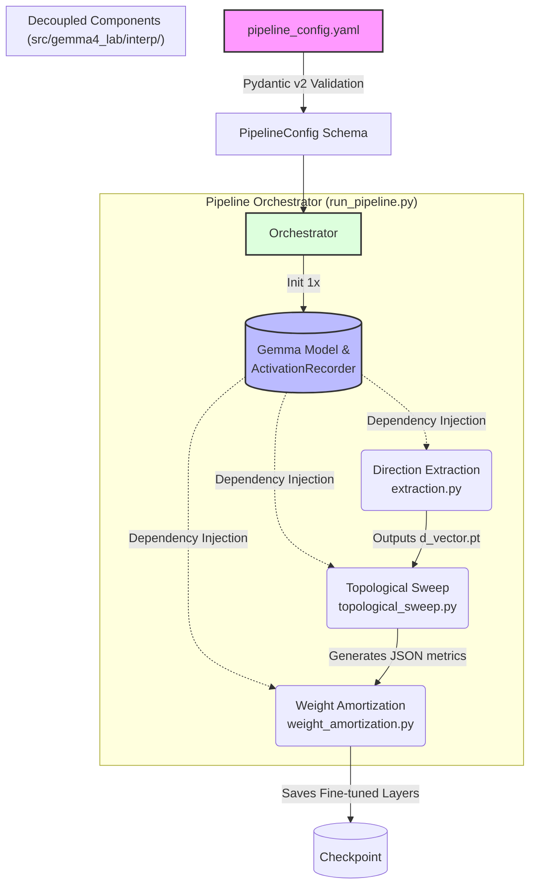

# gemma4-lab

> **Aviso Amigável:** Este projeto ainda está em uma fase bastante incipiente. No momento, o repositório está sendo usado muito mais como um backup seguro para o meu progresso do que para distribuição. O objetivo final é compartilhar o código com a comunidade, mas por enquanto, espere encontrar muita poeira, rascunhos e coisas pela metade! Mas, sinta-se à vontade!

Local Gemma 4 inference + fine-tuning + agent lab on a Mac Mini M2 (16 GB unified memory). Phase 1 ships local HF-Transformers inference with full Logfire observability, plus a thin Gemini wrapper for later synthetic-data work.

## A Note on Naming: Why Gemma 3?

You might notice that despite the project being named **gemma4-lab**, the vast majority of the topological experiments and causal ablation sweeps (e.g., in `scripts/o6_topology.py` and the `O4` modules) are conducted using the **Gemma 3** architecture (specifically `gemma-3-4b-it` and `gemma-3-270m-it`). 

This temporary mismatch exists for two pragmatic research reasons:
1. **Tooling Compatibility (Gemma Scope):** State-of-the-art interpretability tooling, specifically the Gemma Scope Sparse Autoencoders (SAEs), is currently far more mature and accessible for the Gemma 3 ecosystem.
2. **Hardware Constraints:** The local research hardware (Mac Mini M2, 16GB RAM) currently faces memory constraints when running full, unquantized single-shot perturbation sweeps on the newer, heavier Gemma 4 models (e.g., Gemma 4 12B Unified).

This limitation is actively being addressed in upcoming project phases via GGUF/MLX quantization and memory optimizations, which will pave the way for the full transition of the codebase to Gemma 4.

## Setup

Requires conda + Python 3.12.

```bash
conda create -n gemma4-lab python=3.12 -y
conda activate gemma4-lab
pip install uv
uv pip install -e . --group dev
```

## Environment variables

The project reads three variables from the **shell environment** (assumed to be exported in `~/.zshrc` / `~/.bashrc` — no action required if they're already there):

| Var | Used by | Notes |
|---|---|---|
| `GEMINI_API_KEY` | `GeminiClient`, `verify_setup` | Gemini Developer API (https://aistudio.google.com/apikey) |
| `HF_TOKEN` | `GemmaLocal` model load | Hugging Face Hub. Accept the Gemma 4 license on the HF model page first. |
| `LOGFIRE_TOKEN` | `observability.setup()` | Optional. Without it, Logfire runs local-only. |

The keys are read **once** at import time inside `src/gemma4_lab/config.py` and exposed as module constants. Code that needs them does `from gemma4_lab.config import GEMINI_API_KEY` (or `require_gemini_key()`). Secrets are NEVER passed via `Settings` or constructor arguments, NEVER hardcoded, and NEVER asked to be re-exported by setup steps.

A `.env` file in the project root is supported as an override for development, but the shell environment wins when both are set.

## Verify install

```bash
python scripts/verify_setup.py
```

Prints a Rich pass/fail table. First run downloads ~5 GB of Gemma 4 E2B weights — give it a few minutes on the first call.

## Inference CLI

```bash
python scripts/infer.py "Explain attention in one paragraph"
python scripts/infer.py "Solve: 17 * 23" --thinking
python scripts/infer.py "Hi" --model e4b --max-tokens 64
```

## Notebook

```bash
jupyter lab notebooks/01_first_inference.ipynb
```

## Phase 1 scope

Working: local Gemma 4 E2B/E4B inference (bf16, MPS+CPU offload), thinking-mode toggle, Logfire spans on every generation, Gemini 2.5 Pro client. Stubbed (`NotImplementedError` / TODO markers): MLX backend, llama.cpp/GGUF backend, LoRA fine-tuning, synthetic data generation, tool library, agents. 

### Hardware caveat (M2 / 16 GB)

`gemma-4-E2B-it` ships ~9.5 GB of weights (MatFormer: same file as E4B). M2 Metal's per-buffer cap (~7 GiB) rejects a naïve `device_map="mps"` load. Phase 1 works around this with `device_map="auto"` + `max_memory={"mps": "6GiB", "cpu": "14GiB"}` — accelerate offloads ~3/4 of the layers to CPU, so generation is slow (~0.4 tok/s). Phase 2 GGUF/MLX backends will fix this with quantization.

## Arquitetura: Declarative Configuration-as-Code

O repositório passou por uma **refatoração arquitetural profunda** para adotar o paradigma de `Configuration-as-Code`, migrando de um design de pipeline monolítico para um orquestrador modular, extensível e totalmente fracamente acoplado (*loosely coupled*).

### O Orquestrador (Pipeline Manager)

Em vez de scripts rígidos, o pipeline agora é guiado unicamente pelo `pipeline_config.yaml`. Usamos esquemas estritos do **Pydantic v2** (`src/gemma4_lab/config/pipeline_schema.py`) para validar as intenções de execução antes de sequer tocar na GPU. 

O orquestrador central (`scripts/run_pipeline.py`) carrega o `ActivationRecorder` e o LLM uma única vez na memória e os roteia por injeção de dependência através das etapas do grafo (DAG) que estiverem habilitadas.



### Componentes de Interpretabilidade

A inteligência matemática foi isolada em componentes de domínio puro, tornando o *core* agnóstico de infraestrutura:

1. **Direction Extraction**: Extração causal via *Factual Probing* usando hooks de intervenção limpos.
2. **Topological Sweep (TDA)**: Rotaciona o vetor gerado através de *control planes* ortogonais. Captura nuvens de pontos e roda extração de invariantes Betti usando TDA (Topological Data Analysis via `ripser`).
3. **Weight Amortization (CASAL)**: Lida com manipulação avançada do *Autograd* graph, congelando as representações globais do modelo e aplicando `.backward()` exclusivamente na `layer_target` sem vazar gradientes ou acoplar-se ao *loop* de dados principal.

### Testes: Sociable Testing

Adotamos a filosofia estrita de **Sociable Testing**, banindo `Mock` objects. 
Em `tests/conftest.py`, implementamos o `TinyTransformer` — um mini-modelo PyTorch real, matematicamente congruente, porém com `d_model=16` e dimensões restritas. Isso permite que todos os testes (`pytest tests/`) exercitem a matemática completa dos tensores, propagação real do autograd e interceptação fidedigna dos hooks de PyTorch, garantindo robustez extrema com execução em milissegundos.

## Acknowledgments

This project builds upon the open-source infrastructure and foundational models provided by the community. A special thanks to:

* **Google / DeepMind & Google Health**: For the release of the **Gemma 4** and **MedGemma** models, and to their interpretability teams for the continuous research in making these models transparent and accessible.
* **Hugging Face**: For the essential ecosystem, libraries (such as `transformers`), and tools that make local experimentation with state-of-the-art models possible.
* **Neuronpedia**: For their outstanding platform and tools that democratize mechanistic interpretability research and make exploring Sparse Autoencoder (SAE) features accessible.
* **Anthropic Interpretability Team**: For pioneering the foundational research on Dictionary Learning and Sparse Autoencoders that makes modern mechanistic interpretability workflows possible.
* **Pydantic & Logfire Teams**: For providing exceptional tooling for agentic AI architectures and advanced observability.
* **Apple Machine Learning Research & MLX Community**: For their ongoing work in optimizing machine learning infrastructure for Apple Silicon, which empowers local AI development.
