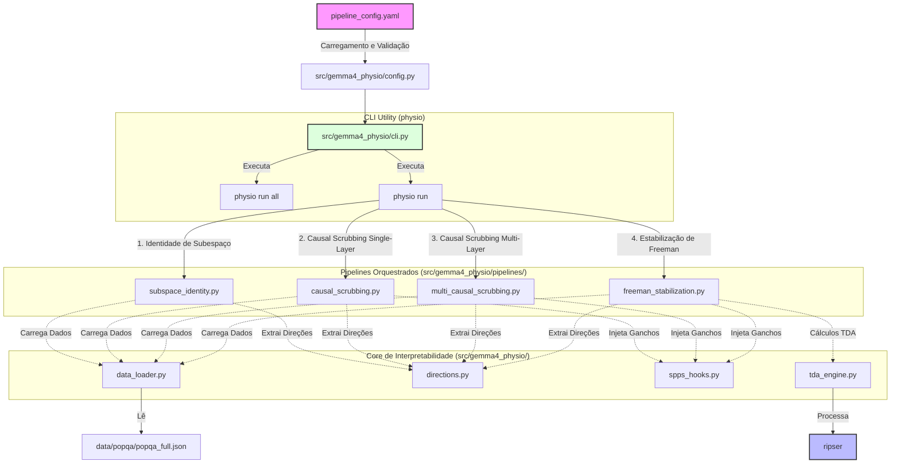

<!-- Copyright (c) 2026 Jose E Moraes. All rights reserved. -->
# gemma4-physio

> **Aviso Amigável:** Este projeto está em fase de pesquisa ativa de interpretabilidade geométrica. O repositório armazena o progresso dos experimentos de representação conceitual e mecânica de atratores no Gemma-3 (4B). Espere encontrar atualizações frequentes e evoluções nos scripts de análise matemática! Sinta-se à vontade para explorar.

Mapeamento geométrico de conceitos, perturbação causal de subespaços e estabilização topológica downstream em arquiteturas Gemma-3 no macOS local (Mac Mini M2, 16 GB de memória unificada).

---

## 1. A Note on Naming: Why Gemma 3?

Apesar de o repositório principal possuir o nome histórico de **gemma4-physio** (preparado para futuras integrações com Gemma 4), os experimentos atuais de perturbação geométrica, Causal Scrubbing e análise topológica (TDA) são realizados sobre o modelo **Gemma-3-4B-it**. 

Isso ocorre por dois motivos fundamentais:
1. **Compatibilidade de Tooling:** Ferramentas de interpretabilidade e modelos comparativos (como os dicionários de autocodificadores esparsos - SAEs do Gemma Scope) encontram-se maduros e validados para o ecossistema Gemma 3.
2. **Restrições de Hardware Locais:** A inferência unificada e as passagens repetidas de gradiente/ablação sob MPS em modelos maiores de 12B+ esgotariam o buffer unificado do chip M2 de 16GB, exigindo técnicas de quantização pesadas (GGUF/MLX) planejadas para as próximas etapas.

---

## 2. Setup do Ambiente

O projeto exige o gerenciador de pacotes **Conda** e Python 3.12.

Criação do ambiente virtual isolado:
```bash
conda create -n gemma4-lab python=3.12 -y
conda activate gemma4-lab
```

Instalação do instalador rápido `uv` e das dependências em modo editável (instalando o pacote `gemma4-physio` e registrando o utilitário de linha de comando `physio`):
```bash
pip install uv
uv pip install -e . --group dev
```

---

## 3. Variáveis de Ambiente

O projeto lê as variáveis do shell de desenvolvimento (definidas via export no seu `~/.zshrc` / `~/.bashrc`):

| Variável | Utilidade | Observação |
|---|---|---|
| `GEMINI_API_KEY` | Integrações com modelos remotos | API Key do Google AI Studio (https://aistudio.google.com/apikey) |
| `HF_TOKEN` | Download de pesos do Gemma-3-4B-it | Hugging Face Token. Aceite os termos de licença do Gemma-3 no site do HF antes. |
| `LOGFIRE_TOKEN` | Telemetria e Spans de execução | Opcional. Sem ele, a coleta do Logfire roda em modo estritamente offline. |

As configurações são importadas automaticamente uma única vez a partir do arquivo `src/gemma4_physio/config.py`.

---

## 4. O Utilitário CLI (`physio`)

O repositório disponibiliza um CLI unificado chamado **`physio`**, registrado no ambiente conda após a instalação editável (`pip install -e .`). O CLI gerencia a execução dos testes geométricos de forma isolada e segura.

### Proteção Anti-OOM Nativa (Metal Performance Shaders - MPS)
Para evitar que múltiplos experimentos concorrentes esgotem a memória unificada do chip Apple Silicon e congelem o macOS, a CLI implementa uma trava exclusiva de arquivo (`fcntl.flock` em `/tmp/gemma4_physio_model.lock`). Se uma execução já estiver ativa no sistema, qualquer novo comando de pipeline será abortado com um erro crítico antes de alocar memória.

### Comandos da CLI:

A CLI possui duas ramificações principais de comandos: `run` (execução de pipelines) e `config` (gerenciamento de parâmetros).

#### Comandos de Configuração:
* **`physio config set-logfire --enable` / `--disable`**  
  Ativa ou desativa o envio de telemetria externa para o painel do Logfire no arquivo `pipeline_config.yaml`.

#### Comandos de Execução:
* **`physio run identity`**  
  Executa o pipeline de **Identidade de Subespaço**. Coleta ativações na Camada 12 e projeta em PCA e UMAP para mostrar a segregação semântica.
* **`physio run scrubbing`**  
  Executa o pipeline de **Causal Scrubbing em Camada Única** perturbando a direção factual na Camada 12 (com amostragem purificada).
* **`physio run multi-scrubbing`**  
  Executa o pipeline de **Causal Scrubbing Multicamada**. Aplica ablação simultânea em série na Camada 12 e na zona de reparo downstream (Layers 20-26) sob amostragem purificada.
* **`physio run freeman`**  
  Executa o pipeline de **Estabilização de Freeman**. Rotaciona a ativação na Camada 12 sob magnitude causal ativa ($R=15000$) e realiza varredura downstream via TDA (Ripser) para calcular persistência homológica ($H_0$ e $H_1$).
* **`physio run all`**  
  Carrega o modelo na GPU uma única vez e executa sequencialmente todos os pipelines que estiverem com a chave `enabled: true` no arquivo `pipeline_config.yaml`, limpando o cache MPS após cada rodada.

---

## 5. Arquitetura Modular

O repositório é guiado por uma abordagem declarativa de **Configuration-as-Code**. O orquestrador central é controlado pelo arquivo de parametrização `pipeline_config.yaml` e validado por esquemas Pydantic v2.

### Fluxo de Execução do Sistema:



### Principais Módulos Internos:
* **`spps_hooks.py`:** Mecanismo de injeção de hooks no residual stream do PyTorch. Suporta perturbações rotacionais isoladas e ablação multicamada concorrente via `ExitStack`.
* **`data_loader.py`:** Amostrador PopQA. Contém a lógica do `Purified Sampler` que remove atalhos estatísticos (cópias nominais diretas no prompt e vazamentos ortográficos de caracteres).
* **`directions.py`:** Algoritmo de extração de direções de conceitos factuais por Diferença de Médias (Difference-of-Means).
* **`tda_engine.py`:** Motor matemático de TDA. Constrói complexos de Vietoris-Rips e calcula diagramas de persistência homológica para as órbitas do circuito de reparo.

---

## 6. Testes Automatizados (Sociable Testing)

Todos os componentes matemáticos e hooks do PyTorch são testados de forma automatizada sem o uso de mocks. Em `tests/conftest.py`, implementamos o `TinyTransformer`, um modelo PyTorch minimalista de 2 camadas que opera em `d_model=16` de forma a propagar gradientes reais e simular a infraestrutura do modelo em milissegundos.

Para executar os testes:
```bash
KMP_DUPLICATE_LIB_OK=TRUE PYTHONPATH=src python -m pytest -vv
```
