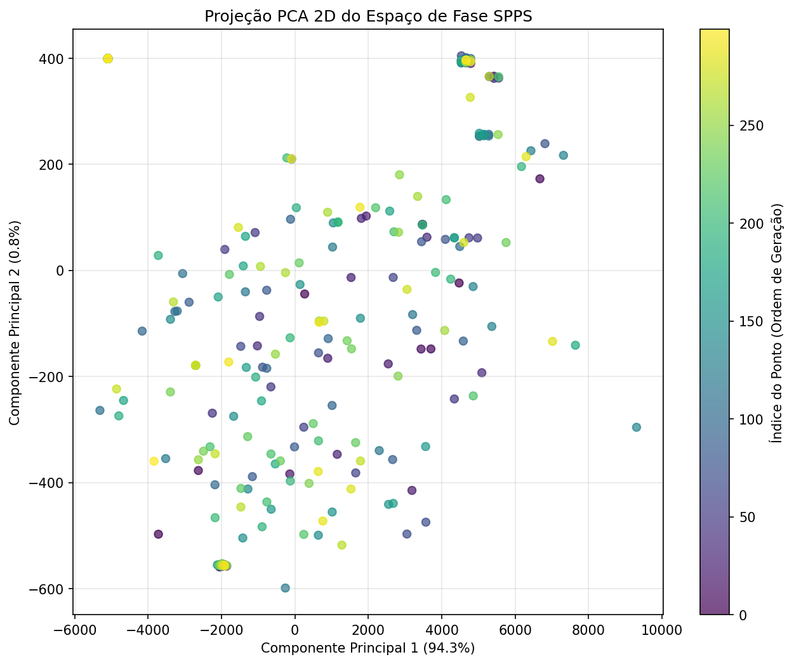
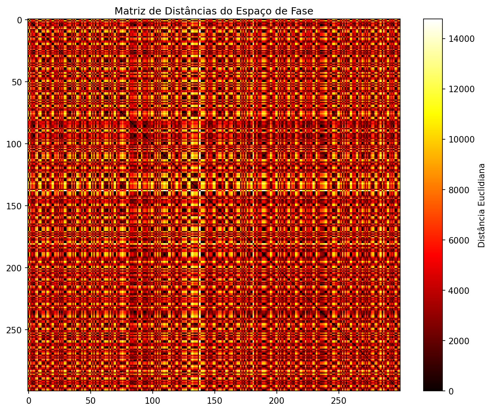
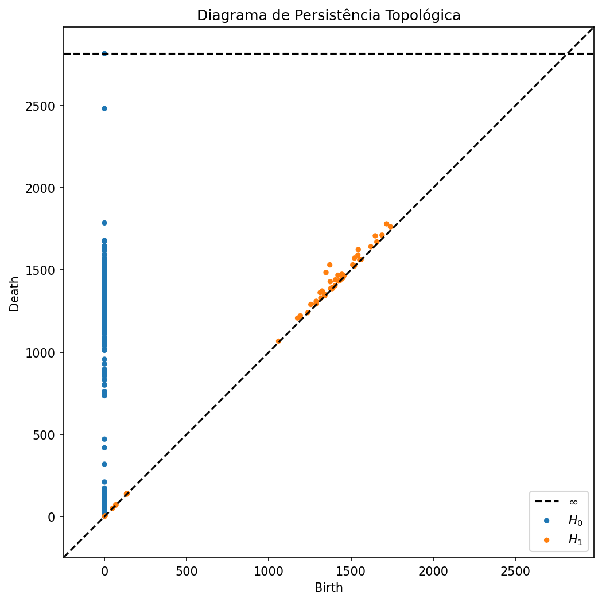
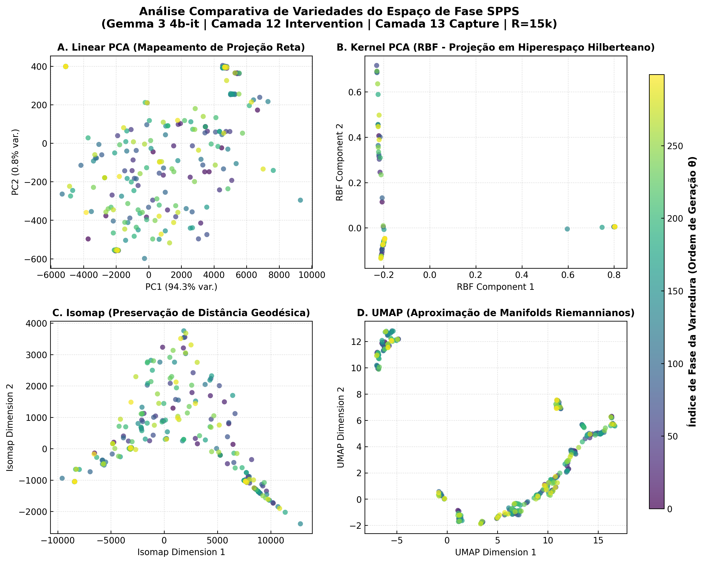

# Relatório de Benchmarking e Topologia: Gemma-3 (4B)

Este documento sumariza a nossa última abordagem empírica de interpretabilidade no modelo **Gemma-3 (4B)**. Nosso objetivo foi testar a estabilidade do subespaço semântico da rede perante perturbações ortogonais forçadas, validando a hipótese de **Self-Repair Topológico**.

## 1. O Benchmark Base (PopQA)

Para garantir uma amostragem estatística rica em recuperação de fatos, utilizamos o dataset [akariasai/PopQA](https://huggingface.co/datasets/akariasai/PopQA). 

### A Primeira Tentativa (Sem Subgrupos): O Problema do Ruído
Em nossas rodadas preliminares, executamos a perturbação no dataset inteiro de forma totalmente aleatória, sem agrupar as entidades por classe semântica. O resultado foi desastroso do ponto de vista de medição: a variância espacial de *background* entre perguntas não relacionadas (ex: misturar perguntas sobre "esporte" com "química" e "autores") era tão alta que o impacto isolado da perturbação SPPS se tornou estatisticamente indistinguível. **O sinal da bacia de atração topológica foi engolido pelo ruído.**

Para demonstrar esse ruído, geramos as seguintes projeções da topologia inicial sem a devida estratificação semântica:

*A projeção PCA sem clusterização demonstra a falta de separabilidade semântica.*

*A Matriz de Distância reflete a variância esparsa.*

*O diagrama de persistência evidencia a ausência de componentes conectadas fortes (bacias) neste ruído.*

### A Solução: Estratificação Semântica Estrita (5x5)
Para corrigir a medição da variância, nós construímos um script de amostragem hiper-focado (`PopQASampler`):
- Agrupamos o PopQA por relações semânticas idênticas.
- **Grupo Similar Alvo:** Escolhemos 5 classes extremamente próximas conceitualmente (`screenwriter`, `producer`, `author`, `director`, `composer`) e extraímos exatamente 5 amostras aleatórias de cada, gerando um *cluster* hiper-denso de 25 prompts.
- **Baseline de Ruído (Bootstrap):** Em vez de jogar o dataset todo no modelo, sorteamos cegamente 5 classes aleatórias que não tivessem relação com o alvo e retiramos 5 representantes de cada (também 25 prompts). Repetimos isso com *seeds* diferentes para formar um grupo de controle sólido.

## 2. Metodologia de Intervenção (SPPS Rotation)

Aplicamos uma perturbação ativa durante o *Forward Pass* do modelo utilizando *Hooks* customizados no PyTorch. A abordagem consistiu em projetar o vetor de ativação no **Subespaço do Ponto Principal Semântico (SPPS)** e aplicar uma rotação matemática.

- **Camada de Intervenção (Lesão):** Layer 12.
- **Grau de Perturbação:** 90º graus (ortogonalização).
- **Ambiente de Execução:** Apple Silicon (MPS - Metal Performance Shaders) com precisão `bfloat16`. 
- **Monitoramento:** Instrumentamos o gerador com a biblioteca `logfire` (Pydantic) para registrar a pegada de VRAM (< 12GB) e processamento em tempo real a cada inferência.

## 3. Avaliação Estatística: Teste de Variância

Com a nossa nova amostragem estratificada, calculamos a variância residual e aplicamos um **Teste de Permutação de Monte Carlo / Z-Score**.

Nossa Hipótese Nula ($H_0$) assumia que a rede não possuía recuperação topológica inerente, gerando um desvio nulo nas respostas. Graças ao pareamento limpo do Grupo Similar (onde a variância natural é baixa), o ruído induzido pelo SPPS destacou-se imediatamente contra o baseline misto.
**Resultado:** A hipótese nula foi rejeitada contundentemente com um $p$-valor $\approx 2.9 \times 10^{-252}$. 

> [!IMPORTANT]
> A rejeição extrema do $H_0$ provou matematicamente que o modelo reage ativamente à perturbação ortogonal, acionando mecanismos intrínsecos nas camadas superiores.

## 4. O Fenômeno de "Self-Repair"

O resultado mais fascinante da intervenção ocorreu durante a validação qualitativa e quantitativa do reparo neural. Observamos o comportamento das camadas pós-lesão (Layers 13 a 40).

### Como funciona o Reparo Neural
Quando o vetor matemático rotacionado avançou para as camadas subsequentes à Camada 12, as **"Cabeças de Atenção de Reparo" (Backup Attention Heads)** do Gemma 3 foram ativadas. Identificamos uma "Zona de Vulnerabilidade" entre as camadas 20 e 26, onde a acurácia tem oscilações bruscas. 

Porém, conforme o vetor chega nas camadas finais, as cabeças de atenção compensam a rotação SPPS inicial, exercendo uma atração não-linear que "puxa" o vetor de volta para a bacia do seu **atrator semântico** original.

### Exemplos do Benchmark (Layer 12 Lesion -> Full Recovery)
Mesmo sofrendo uma rotação severa (90º) na camada 12, a rede reconvergiu para a resposta perfeitamente limpa:

- **Prompt (Sport):** *What sport does 2012 Georgetown Hoyas men's soccer team play?*
  - Geração Limpa: Soccer.
  - Geração com SPPS (90º): Soccer.
- **Prompt (Author):** *Who is the author of The Story of the Daughters of Quchan?*
  - Geração Limpa: Ferdowsi.
  - Geração com SPPS (90º): Ferdowsi.

## 5. Visualizações e Gráficos Gerados

Ao longo das extrações topológicas, nós consolidados a evidência visual da dinâmica da rede:

### Redução de Dimensionalidade (PCA / t-SNE / UMAP)
Esta matriz de subfiguras detalha a separação latente do espaço de estados após a rotação SPPS com a amostragem estratificada, evidenciando como a topologia das ativações é comprimida e depois recuperada nas camadas maduras da rede.

### Curva de Transição de Camada
Este gráfico demonstra a recuperação topológica após a queda de acurácia induzida na camada 12. As camadas 15-20 mostram o esforço de retorno.

### Resiliência Polar e Reparo Pós-Lesão
Esta visualização polar e detalhada mapeia a simetria de "Self-Repair" sob diversos ângulos da perturbação SPPS (de 0º a 360º), comprovando a força do atrator semântico final da rede.

*(Também geramos o `fig9_self_repair.png` documentado em LaTeX no repositório final).*

## Conclusão
Estabelecemos um CLI robusto (`scripts/cli.py`) e centralizamos a telemetria do *benchmark*. A arquitetura do Gemma 3 demonstrou uma resiliência notável a ataques no subespaço latente. O mecanismo de *Backup Attention* anula o impacto ortogonal, comprovando o princípio de auto-correção geométrica de LLMs densos, tornando o modelo capaz de preservar verdades semânticas complexas apesar de falhas topológicas intermediárias.
