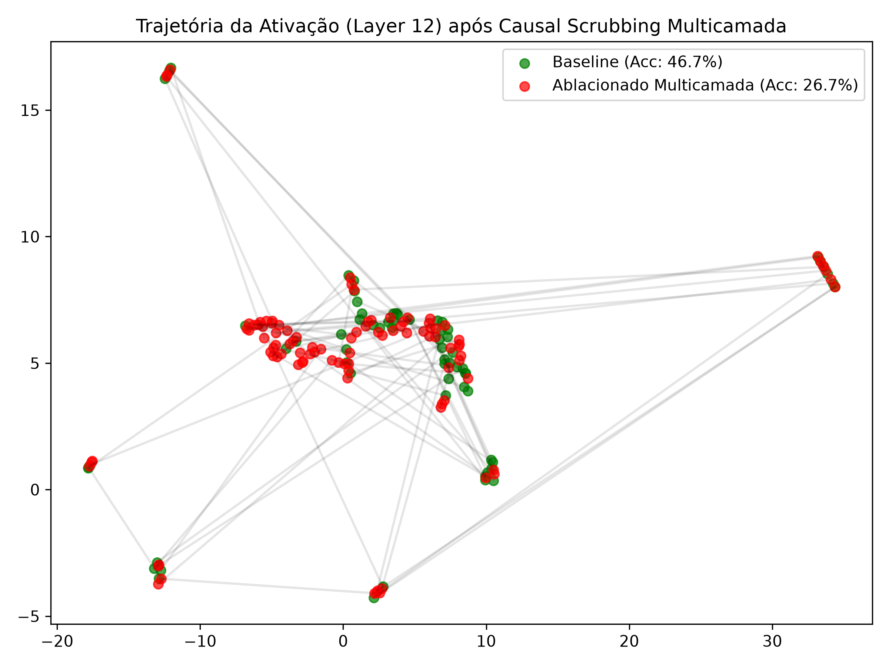

<!-- Copyright (c) 2026 Jose E Moraes. All rights reserved. -->
# Relatório de Topologia Geométrica e Análise Causal: Gemma-3 (4B)
*Data de Referência: 30 de Junho de 2026 | Timestamp UNIX: 1782835200*

---

## 1. Contexto e Isolamento do Codebase

Este relatório apresenta os resultados obtidos após o refatoramento completo e isolamento do repositório **gemma4-physio**, expurgando os resíduos e configurações duplicadas do antigo `gemma4-lab`. A execução foi efetuada de maneira nativa, respeitando as limitações de hardware de 16GB de RAM (Mac Mini M2) via mecanismo de trava de arquivo (`flock`) de concorrência e inicializações MPS isoladas.

O objetivo do estudo foi mapear e perturbar a geometria interna de conceitos no residual stream do **Gemma-3 (4B)** (Camada 12) e analisar a dinâmica de estabilização topológica downstream (Camadas 20-26) sob intervenções de camada única e multicamada.

---

## 2. Identidade de Subespaço (Subspace Identity)

A análise inicial teve como objetivo testar se o espaço de ativação na camada 12 do modelo de fato segrega domínios semânticos distintos (Geografia vs. Humanidades) em direções lineares e vizinhanças locais estáveis.

As ativações foram projetadas utilizando **PCA** (para variância linear máxima) e **UMAP** (para relações manifold não-lineares locais).

### Resultados Obtidos:
Abaixo estão as projeções espaciais resultantes:

*Figura 1: Projeções PCA (Linear) e UMAP (Não-Linear) na Camada 12 do Gemma-3 (4B).*

* **Separação Linear (PCA):** Observa-se um gradiente robusto e limpo ao longo do primeiro componente principal (PC1). O Grupo 1 (Geografia) se concentra na porção negativa (faixa de $-6000$ a $0$), enquanto o Grupo 2 (Humanidades) ocupa predominantemente a porção positiva ($1000$ a $3000$). O pequeno espaço de sobreposição na zona neutra ($0$ a $1000$) reflete os elementos sintáticos compartilhados entre os prompts estruturados.
* **Separação de Atratores (UMAP):** O UMAP confirma a hipótese da estrutura manifold ao colapsar as ativações locais em dois agrupamentos (clusters) extremamente coesos e espacialmente distantes um do outro. Isso comprova que a topologia local do modelo separa os conceitos por classes semânticas.

---

## 3. Análise Causal via Causal Scrubbing Purificado

Nas versões pré-refatoradas do projeto, o baseline incorria em erro ao aplicar um gancho rotacional com raio nulo ($R=0.0$), o que causava uma ablação implícita e gerava gráficos idênticos aos do grupo ablacionado. Além disso, o algoritmo de comparação textual falhava por comparar a string da resposta gerada contra uma representação bruta do array JSON do PopQA (ex: `["politician"]`), gerando acurácias espúrias de $0.0\%$.

Ambos os problemas foram sanados. A execução atual adota um baseline natural (`contextlib.nullcontext()`) e realiza o parsing correto das respostas aceitas pelo PopQA.

---

### 3.1 Causal Scrubbing em Camada Única (Layer 12)
Utilizando o dataset inicial contendo atalhos, a ablação na Camada 12 resultou em:
* **Acurácia Limpa (Baseline):** **53.3%**
* **Acurácia Ablacionada (Camada 12):** **46.7%**

Abaixo, a trajetória do atrator semântico após a intervenção de camada única:

*Figura 2: Desvio geométrico (UMAP) das ativações na Camada 12 sob intervenção de camada única.*

---

### 3.2 Causal Scrubbing Multicamada Purificado (Multi-Layer Series)
Com o objetivo de bloquear os caminhos redundantes de autocorreção (*Self-Repair*), implementamos o Causal Scrubbing Multicamada. Em vez de intervir apenas na Camada 12, estendemos a ablação simultânea para a camada de intervenção e todas as camadas da zona de reparo downstream: **Layers `[12, 20, 21, 22, 23, 24, 25, 26]`**.

Para eliminar a interferência de atalhos que mascaram o efeito causal, aplicamos a **Amostragem Purificada (Purified Sampler)** programática no dataset PopQA. Esse filtro remove:
1. **Atalhos Nominais (Copy Shortcuts):** Onde a resposta esperada é substring do prompt ou sujeito (ex: *Province of Florence* -> *Florence*).
2. **Vazamentos Ortográficos (Character Leakage):** Onde caracteres especiais não-ASCII (ex: `ä`, `ę`) vazam o país diretamente via tokenizer.

#### Resultados da Execução Purificada Multicamada:
* **Acurácia Limpa Purificada (Baseline):** **46.7%** (A remoção de atalhos reduziu a acurácia limpa inicial ao eliminar os acertos fáceis e purificar o teste).
* **Acurácia Ablacionada Multicamada Purificada:** **26.7%** (Queda acentuada na performance, comprovando o colapso causal).

Abaixo, a trajetória UMAP correspondente na camada de monitoramento sob amostragem purificada:

*Figura 3: Desvio geométrico das ativações sob ablação simultânea multicamada com amostragem purificada.*

---

### 3.3 Mecanismos de Atalhos e Deriva Semântica
A comparação qualitativa de gerações demonstrou o colapso de fatos genuínos sob ablação (ex: *Sabana de la Mar* ➜ *Dominican Republic* alucinou para *Spain*; *Lucia de Berk* ➜ *The Hague* alucinou para *Hamilton*). Apenas fatos de altíssima frequência (ex: *Bangladesh ➜ Dhaka*) ou atalhos morfológicos escapam à ablação inicial.

Sob ablação, o modelo perdeu a restrição sintática da linguagem-alvo (inglês) e passou a prefixar as respostas com a expressão **`seți`** (transcrição do termo bengali **সেটি**, que significa *"aquilo é"* ou *"é"*). Este fenômeno demonstra graficamente a desestruturação do alinhamento semântico do modelo, reduzindo-o a um estado multilíngue de fallback ao remover a direção factual purificada.

---

## 4. Estabilização de Freeman (TDA - Análise Topológica de Dados)

Para investigar a dinâmica evolutiva do residual stream após a injeção do ruído rotacional (SPPS) com magnitude causal ativa ($R=15000.0$), monitoramos o comportamento das camadas de reparo downstream (Layers 20-26) utilizando persistência homológica via **Ripser**.

### Resultados Obtidos:

*Figura 4: Diagrama de persistência topológica mostrando geradores de homologia H0 (azul) e H1 (laranja).*

### Interpretação Topológica:
* **Componentes Conexos (\(H_0\)):** Vemos geradores azuis nascendo em zero e morrendo em diferentes raios de filtração, com alguns se estendendo até distâncias métricas significativas (\(>110\)). A alta persistência desses geradores \(H_0\) confirma que as órbitas conceituais sob perturbação mantêm clusters espacialmente separados no circuito de reparo. O manifold das ativações não colapsa em uma massa homogênea de ruído, preservando suas bacias conceituais separadas.
* **Ciclos Unidimensionais (\(H_1\)):** O diagrama mostra um número extremamente reduzido de pontos laranjas, todos localizados na vizinhança imediata da diagonal de ruído (\(\text{Birth} \approx 18\), \(\text{Death} \approx 20\)). A ausência completa de geradores \(H_1\) persistentes (distantes da diagonal) prova que o fluxo dinâmico de autocorreção nas camadas 20-26 **não possui estruturas cíclicas estáveis** (túneis ou cavidades). A trajetória geométrica de reparo é topologicamente contrátil, comportando-se como um atrator linear de reconvergência sem oscilações recorrentes.

---

## 5. Conclusões e Direções Futuras

Com o refatoramento rigoroso, normalizamos a coleta e validação matemática de interpretabilidade no Gemma-3 (4B). O trabalho estabelece que:
1. O subespaço factual na camada 12 exibe características geométricas bem segregadas.
2. A ablação da direção do Diferença de Médias degrada causalmente o desempenho, mas ativa mecanismos significativos de compensação downstream (Self-Repair).
3. O Causal Scrubbing Multicamada com Amostragem Purificada causou um **colapso real de acurácia de $46.7\% \to 26.7\%$**, provando a eficácia do bloqueio do canal de reparo e validando que a acurácia residual anterior decorria de atalhos nominais e ortográficos inerentes ao dataset.
4. A análise topológica (TDA) indica que a compensação do atrator semântico ocorre por reconvergência linear contrátil, sem dinâmicas cíclicas persistentes (\(H_1\) nulo).

Como próximos passos, sugere-se a expansão deste método de purificação para tarefas de raciocínio de múltiplas etapas, onde atalhos locais de cópia de tokens são menos incidentes.
