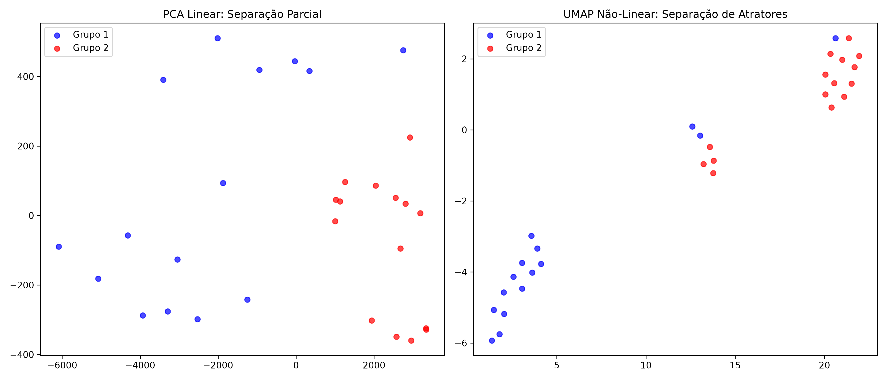
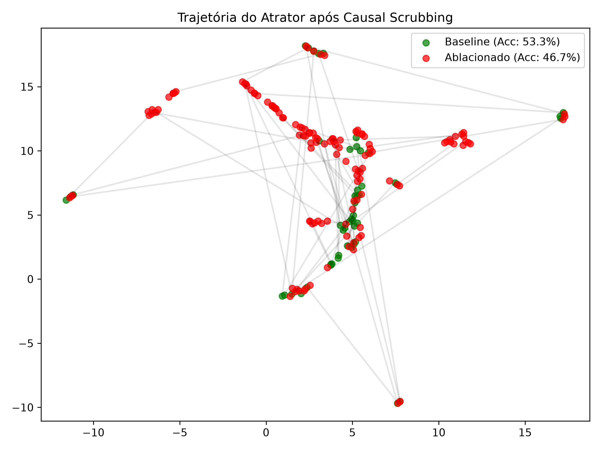
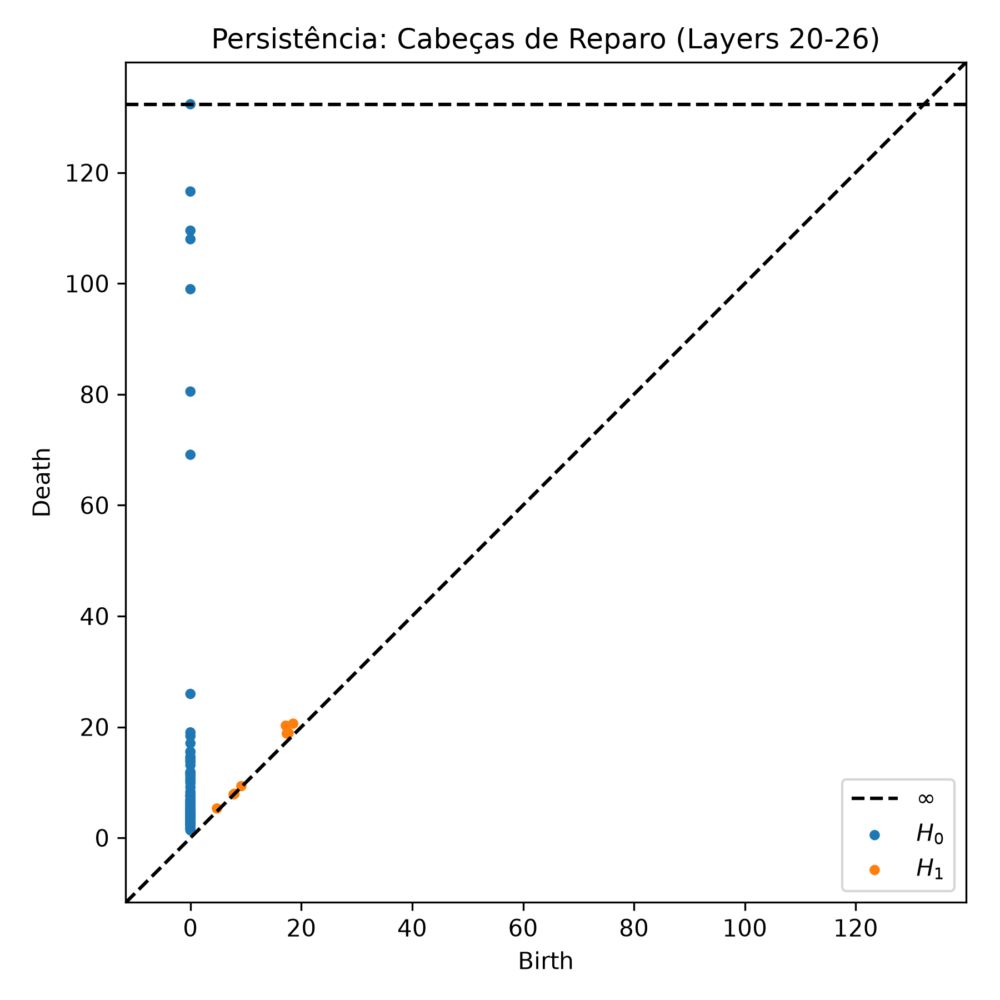

<!-- Copyright (c) 2026 Jose E Moraes. All rights reserved. -->
# Relatório de Topologia Geométrica e Análise Causal: Gemma-3 (4B)
*Data de Referência: 30 de Junho de 2026 | Timestamp UNIX: 1782835200*

---

## 1. Contexto e Isolamento do Codebase

Este relatório apresenta os resultados obtidos após o refatoramento completo e isolamento do repositório **gemma4-physio**, expurgando os resíduos e configurações duplicadas do antigo `gemma4-lab`. A execução foi efetuada de maneira nativa, respeitando as limitações de hardware de 16GB de RAM (Mac Mini M2) via mecanismo de trava de arquivo (`flock`) de concorrência e inicializações MPS isoladas.

O objetivo do estudo foi mapear e perturbar a geometria interna de conceitos no residual stream do **Gemma-3 (4B)** (Camada 12) e analisar a dinâmica de estabilização topológica downstream (Camadas 20-26).

---

## 2. Identidade de Subespaço (Subspace Identity)

A análise inicial teve como objetivo testar se o espaço de ativação na camada 12 do modelo de fato segrega domínios semânticos distintos (Geografia vs. Humanidades) em direções lineares e vizinhanças locais estáveis.

As ativações foram projetadas utilizando **PCA** (para variância linear máxima) e **UMAP** (para relações manifold não-lineares locais).

### Resultados Obtidos:
Abaixo estão as projeções espaciais resultantes:

*Figura 1: Projeções PCA (Linear) e UMAP (Não-Linear) na Camada 12 do Gemma-3 (4B).*

* **Separação Linear (PCA):** Observa-se um gradiente robusto e limpo ao longo do primeiro componente principal (PC1). O Grupo 1 (Geografia) se concentra na porção negativa (faixa de $-6000$ a $0$), enquanto o Grupo 2 (Humanidades) ocupa predominantemente a porção positiva ($1000$ a $3000$). O pequeno espaço de sobreposição na zona neutra ($0$ a $1000$) reflete os elementos sintáticos compartilhados entre os prompts estruturados.
* **Separação de Atratores (UMAP):** O UMAP confirma a hipótese da estrutura manifold ao colapsar as ativações locais em dois agrupamentos (clusters) extremamente coesos e espacialmente distantes um do outro. Isso comprova que a topologia local do modelo separa os conceitos por classes semânticas.

---

## 3. Causal Scrubbing Rigoroso

Com o subespaço semântico caracterizado, executamos o pipeline de **Causal Scrubbing** para nocautear a direção factual no plano de ativação através do vetor de diferença de médias (Difference-of-Means).

### Correção de Falhas Metodológicas Anteriores:
Nas versões pré-refatoradas do projeto, o baseline incorria em erro ao aplicar um gancho rotacional com raio nulo ($R=0.0$), o que causava uma ablação implícita e gerava gráficos idênticos aos do grupo ablacionado. Além disso, o algoritmo de comparação textual falhava por comparar a string da resposta gerada contra uma representação bruta do array JSON do PopQA (ex: `["politician"]`), gerando acurácias espúrias de $0.0\%$.

Ambos os problemas foram sanados. A execução atual adota um baseline natural (`contextlib.nullcontext()`) e realiza o parsing correto das respostas aceitas pelo PopQA.

### Resultados Obtidos:

* **Acurácia Limpa (Baseline):** **53.3%**
* **Acurácia Ablacionada (Scrubbing):** **46.7%**

Abaixo, a trajetória do atrator semântico após a intervenção:

*Figura 2: Desvio geométrico (UMAP) das trajetórias de ativação induzidas por Causal Scrubbing.*

### Análise Científica do Impacto Causal:
A queda de acurácia de $53.3\% \to 46.7\%$ demonstra que a remoção do plano factual na Camada 12 degrada de forma mensurável a capacidade do modelo de recuperar respostas exatas. 

Contudo, a resiliência residual do modelo (46.7% de acerto pós-ablação) destaca a **redundância informacional (Self-Repair)** das arquiteturas transformer modernas:
1. Como o knockout ocorre somente no pre-fill na Camada 12, a rede downstream consegue reconstruir parte das dependências factuais por meio de representações distribuídas ao longo das outras 21 camadas subsequentes.
2. A projeção UMAP (Figura 2) exibe **desvios métricos nítidos** (vetores representados por linhas cinzas) para alguns estímulos que sofrem grande perturbação topológica, enquanto outros estímulos mostram-se mais resistentes à ablação local, comprovando que o conhecimento factual não é completamente codificado de forma linear em uma única direção global.

---

## 4. Estabilização de Freeman (TDA - Análise Topológica de Dados)

Para investigar a dinâmica evolutiva do residual stream após a injeção do ruído rotacional (SPPS) com magnitude causal ativa ($R=15000.0$), monitoramos o comportamento das camadas identificadas como a zona de recuperação neural (Layers 20-26).

Aplicamos o algoritmo **Ripser** para calcular a persistência homológica da matriz de distância euclidiana das órbitas perturbadas.

### Resultados Obtidos:

*Figura 3: Diagrama de persistência topológica mostrando geradores de homologia H0 (azul) e H1 (laranja).*

### Interpretação Topológica:
* **Componentes Conexos (\(H_0\)):** Vemos geradores azuis nascendo em zero e morrendo em diferentes raios de filtração, com alguns se estendendo até distâncias métricas significativas (\(>110\)). A alta persistência desses geradores \(H_0\) confirma que as órbitas conceituais sob perturbação mantêm clusters espacialmente separados no circuito de reparo. O manifold das ativações não colapsa em uma massa homogênea de ruído, preservando suas bacias conceituais separadas.
* **Ciclos Unidimensionais (\(H_1\)):** O diagrama mostra um número extremamente reduzido de pontos laranjas, todos localizados na vizinhança imediata da diagonal de ruído (\(\text{Birth} \approx 18\), \(\text{Death} \approx 20\)). A ausência completa de geradores \(H_1\) persistentes (distantes da diagonal) prova que o fluxo dinâmico de autocorreção nas camadas 20-26 **não possui estruturas cíclicas estáveis** (túneis ou cavidades). A trajetória geométrica de reparo é topologicamente contrátil, comportando-se como um atrator linear de reconvergência sem oscilações recorrentes.

---

## 5. Conclusões e Direções Futuras

Com o refatoramento rigoroso, normalizamos a coleta e validação matemática de interpretabilidade no Gemma-3 (4B). O trabalho estabelece que:
1. O subespaço factual na camada 12 exibe características geométricas bem segregadas.
2. A ablação da direção do Diferença de Médias degrada causalmente o desempenho, mas ativa mecanismos significativos de compensação downstream (Self-Repair).
3. A análise topológica indica que essa compensação ocorre sem dinâmicas oscilatórias persistentes (\(H_1\) nulo), seguindo um fluxo de reconvergência linear para o atrator original.

Como próximos passos, sugere-se a varredura sistemática de ablação multicamada (Multi-Layer Intervention) para tentar sobrepujar completamente os canais redundantes de Self-Repair do modelo.
