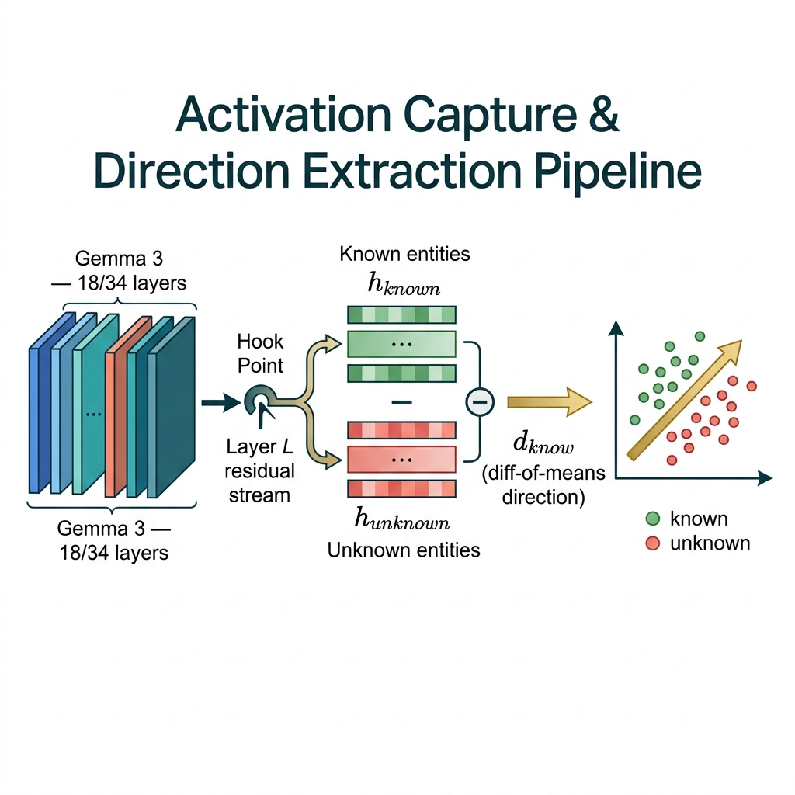
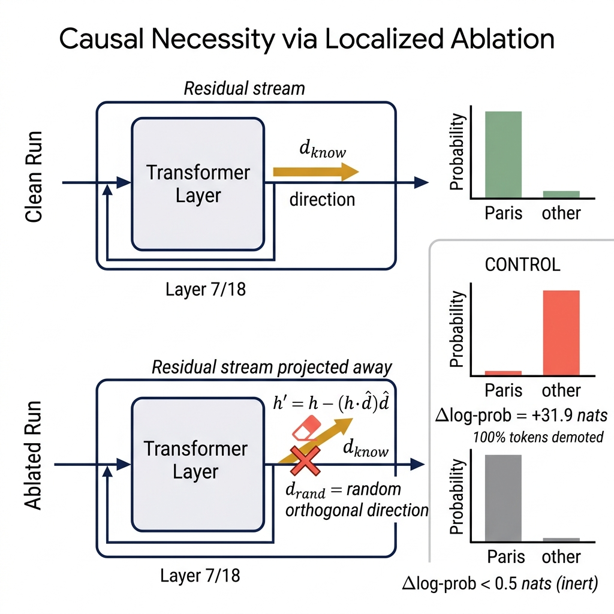
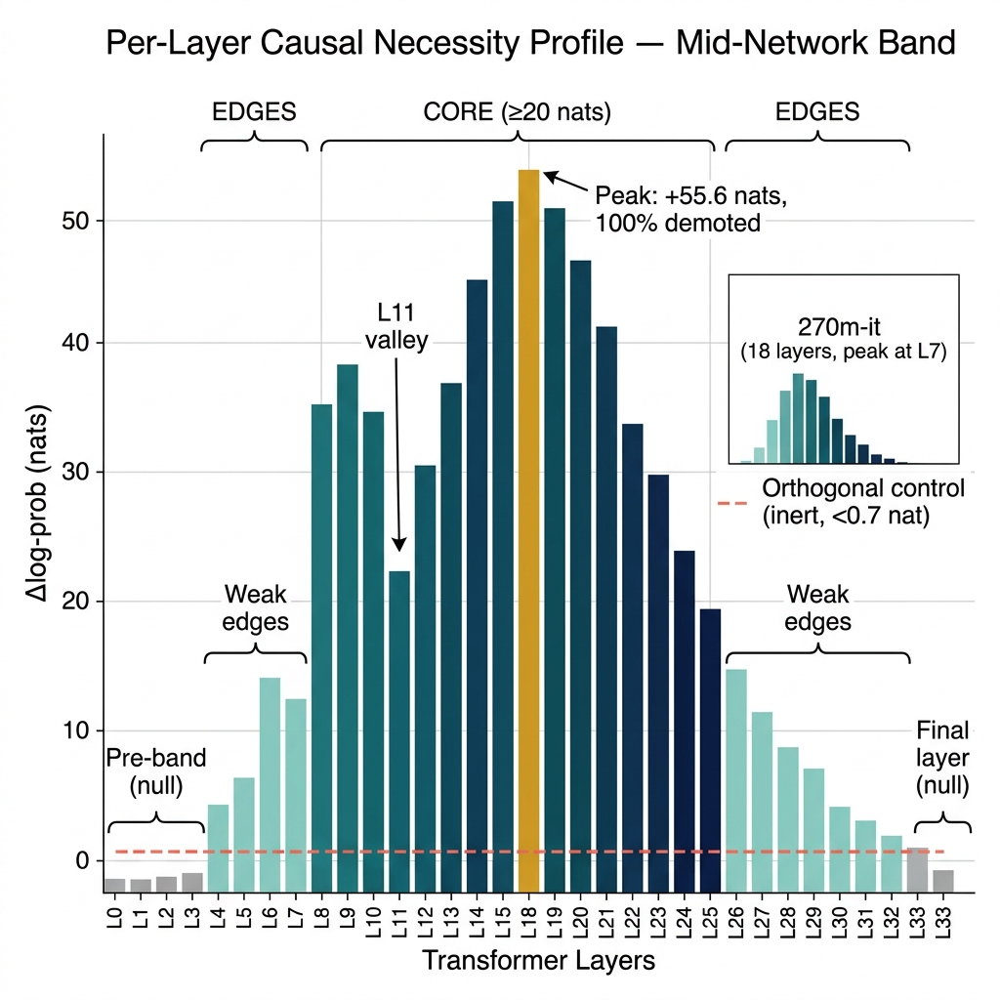
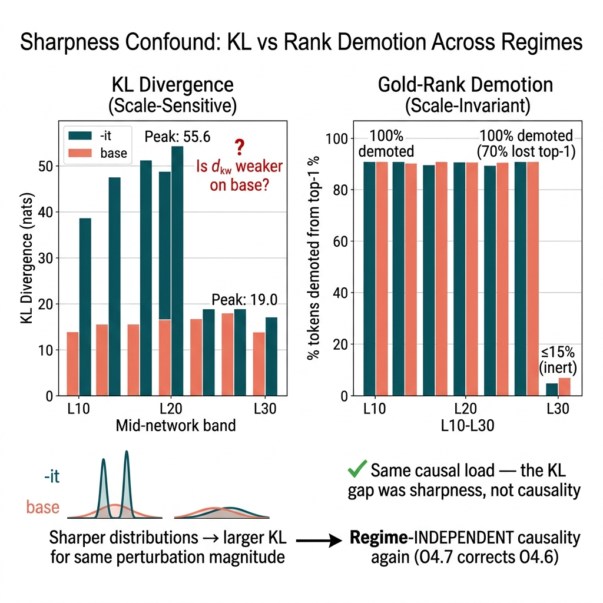
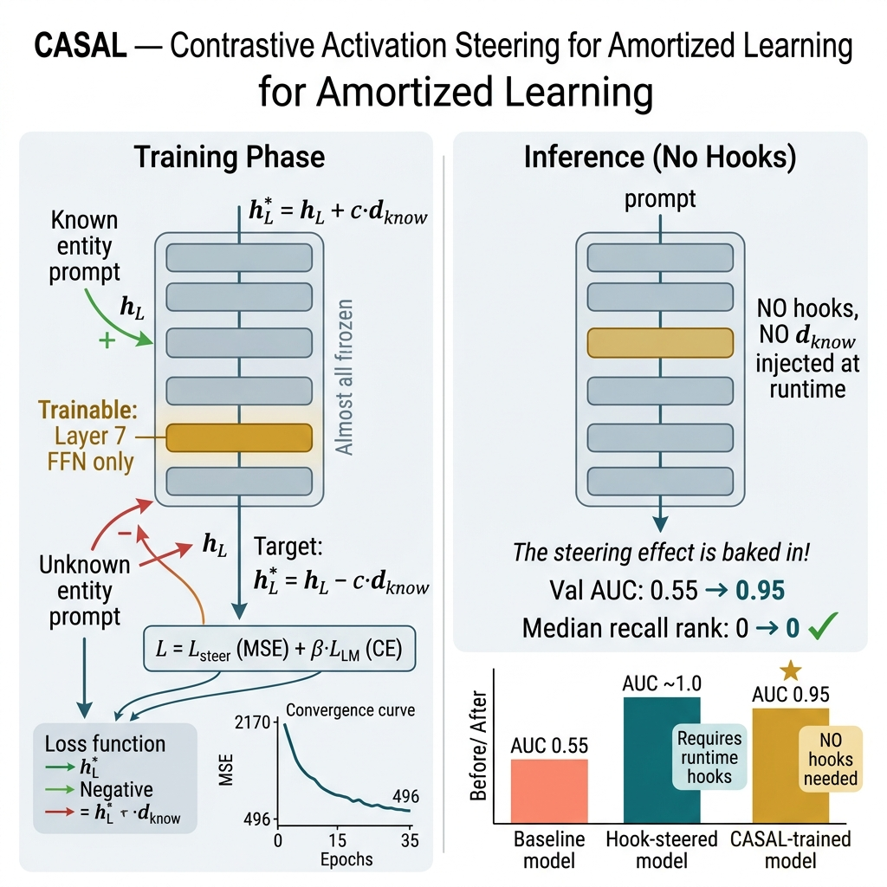

<header class="hero">
  
Edição Acessível

  <h1>Olhando Dentro do Gemma 3</h1>
  
Autor: Jose Elvano Moraes &bull; 21 de junho de 2026 &bull; 22:25

  
Um guia ilustrado para a nossa pesquisa de interpretabilidade mecanicista — o que fizemos, o que descobrimos e por que isso importa. Escrito para toda a equipe, não apenas especialistas em ML.

  

    google/gemma-3-270m-it
    google/gemma-3-4b-it
    gemma-scope-2
  

</header>

<!-- ===== READING GUIDE ===== -->

  
📖

  

    <h4>Como Ler Este Relatório</h4>
    
Termos técnicos aparecem com um sublinhado pontilhado — <b>passe o mouse sobre eles</b> (ou toque no celular) para ver um painel explicando o termo. Cada seção começa com um resumo em linguagem simples antes dos detalhes técnicos.

    

      

 Resumo em linguagem simples

      

 💡 Por que isso importa

      

 Resultado confirmado

      

 Descoberta matizada

    

  

## § 0 O que é Interpretabilidade Mecanicista?

  
🔑 A Grande Ideia

  Modelos de Linguagem Grandes (LLMs) como ChatGPT, Gemini ou Gemma são frequentemente chamados de <b>"caixas pretas"</b> — eles produzem resultados impressionantes, mas ninguém entende completamente <em>como</em> chegam às suas respostas. A <b>interpretabilidade mecanicista</b> é o esforço científico para abrir essa caixa preta: entender as representações internas, estruturas e cálculos que um modelo usa ao processar a linguagem.

Pense desta forma: quando você pergunta a um modelo *"Qual é a capital da França?"* e ele responde *"Paris"*, essa resposta não vem de uma tabela de busca estruturada. Ela emerge de bilhões de operações numéricas fluindo através de dezenas de camadas internas. A **interpretabilidade mecanicista** pergunta: *onde* nessas camadas o modelo "sabe" a resposta? *Como* esse conhecimento é direcionado para a saída? E podemos *intervir* nessas estruturas internas para mudar o que o modelo faz?

  
💡 Por que isso é importante

  
Entender como um modelo funciona internamente não é apenas curiosidade acadêmica. Isso desbloqueia uma nova geração de <b>capacidades práticas</b> que são impossíveis a partir do exterior:

  
🧭 <b>Monitoramento</b> — Detectar quando um modelo "sabe" que está adivinhando vs. recuperando um fato, <em>antes</em> que a resposta chegue ao usuário. Como um painel de controle da confiança interna do modelo.

  
💉 <b>Direcionamento (Steering)</b> — Injetar ou suprimir comportamentos específicos (veracidade, segurança, estilo) manipulando sinais internos, <em>sem retreinar o modelo inteiro</em>. Pense nisso como ajustar botões de sintonia fina.

  
🔧 <b>Gravar alterações nos pesos</b> — Ir um passo além: tornar esses ajustes internos <em>permanentes</em> nos parâmetros do modelo, de modo que ele se comporte de forma diferente por padrão. Sem hooks, sem sobrecarga de processamento. É isso que o CASAL (§ 8) alcança.

  
Essas técnicas não alteram a arquitetura física do modelo. Elas funcionam <em>dentro</em> da estrutura existente — o que as torna extremamente leves, rápidas e implantáveis em hardware de consumo.

### O que este relatório cobre
Aplicamos essas técnicas ao modelo de linguagem **Gemma 3** da Google para estudar uma questão específica: *podemos encontrar uma única "direção" interna — um sinal matemático dentro do modelo — que distinga entidades que o modelo conhece daquelas que não conhece?* E, se sim, esse sinal é de fato *usado* pelo modelo (causal) ou apenas um subproduto correlacional de como a informação é organizada?

A resposta acabou se revelando cheia de nuances e cientificamente interessante — exatamente o que uma boa ciência deve ser. Continue lendo para ver os resultados ilustrados.

---

## § 1 Resultados de um Relance

  
📋 Resumo

  Realizamos uma série de experimentos cada vez mais rigorosos. Cada cartão abaixo mostra uma medição chave. Verde = resultado forte. Azul = medição notável. Amarelo = resultado que exigiu uma interpretação mais matizada. Os números em si são explicados nas seções seguintes.

  

    
Validação do Toolkit

    
5/5 ✓

    
Todos os instrumentos calibrados antes de quaisquer experimentos

  

  

    
Sinal Encontrado?

    

      AUC
AUC (Área Sob a Curva)

Um score de 0 a 1 que mede quão bem um classificador separa dois grupos. 0.5 = adivinhação aleatória. 1.0 = separação perfeita.

Neste relatório

Mede quão bem a nossa direção extraída d_know separa entidades "conhecidas" de "desconhecidas" dentro do modelo. Nosso 0.958 significa uma separação quase perfeita — o sinal é real.

      0.958

    
O sinal interno separa claramente o conhecido vs. desconhecido

  

  

    
Causalmente Importante?

    
+55.6 nats

    
Remover o sinal devasta a recuperação (efeito de pico)

  

  

    
Onde no modelo?

    
L4–L32

    
Uma banda ampla abrangendo 29 de 34 camadas

  

  

    
Específico para Recall?

    
Genérico

    
Importante para todas as saídas, não apenas recuperação factual

  

  

    
Ponto Doce de Intervenção

    
L12

    
Intervenção de alta eficácia com mínima perturbação de controle

  

  

    
Gravado nos Pesos?

    
AUC 0.95

    
O CASAL amortizou com sucesso o efeito de direcionamento

  

---

## § 2 Como Extraímos Sinais Internos

  
🔎 Em Linguagem Simples

  Imagine que o modelo tem 34 "estágios de processamento" internos (chamados de <b>camadas</b>). Em cada estágio, o modelo constrói uma representação interna do texto — uma longa lista de números chamada de <b>vetor de ativação</b>. Nós "interceptamos" uma camada específica e lemos esses números para dois tipos de perguntas: coisas que o modelo <em>sabe</em> (como "capital da França → Paris") e coisas que ele <em>não sabe</em> (entidades fictícias). Em seguida, calculamos a <em>diferença média</em> entre esses dois grupos. Essa diferença é uma única "direção" no espaço interno do modelo que chamamos de <code>d_know</code> — é essencialmente a bússola interna do modelo para "eu sei isso" vs. "eu não sei."

  
  

    Fig. 1
    
Pipeline de Captura de Ativação e Extração de Direção

    

      À esquerda: o
      Transformer Gemma 3
Transformer

A arquitetura de rede neural por trás de todos os LLMs modernos. Ela processa texto através de uma pilha de "camadas", cada uma refinando uma representação interna da entrada.

Neste relatório

O Gemma 3 tem 18 camadas (modelo 270m) ou 34 camadas (modelo 4b). Nós instrumentamos cada camada para ler o estado interno do modelo.

      com camadas empilhadas. Um
      hook
Hook (Gancho de Intercepção)

Um mecanismo de programação que permite "interceptar" uma rede neural e ler (ou modificar) os números que fluem por ela, sem alterar o modelo em si.

Neste relatório

Colocamos hooks em camadas específicas para capturar vetores de ativação. Pense nisso como colocar uma sonda de sensor dentro do pipeline de processamento do modelo.

      na camada L captura o
      residual stream
Residual Stream (Fluxo Residual)

A "via expressa principal" de informação dentro de um transformer. Em cada camada, a informação é lida e escrita de volta a este fluxo. Ele acumula todo o processamento feito por cada camada.

Neste relatório

Lemos as ativações do fluxo residual em cada camada — é onde reside o d_know. Ablacionar (apagar) uma direção deste fluxo testa se esse sinal é causalmente importante.
.
      No centro: ativações para entidades conhecidas (verde) e desconhecidas (vermelho). À direita: a
      diferença de médias (diff-of-means)
Diff-of-Means

Uma técnica simples: calcular o vetor de ativação médio para o grupo A, o vetor médio para o grupo B e subtraí-los. O resultado é uma única direção que melhor separa os dois grupos.

Neste relatório

d_know = média(ativações conhecidas) − média(ativações desconhecidas). Isso nos dá a "direção do conhecimento" — o eixo no espaço interno que separa o que o modelo sabe do que não sabe.

      produz <code>d_know</code>, que separa os grupos em uma projeção PCA. Para mais detalhes sobre as ferramentas e visualizações de suporte de ativação, veja o gemma-scope-2 <a href="#references" style="color:var(--accent); text-decoration:none; font-weight:bold;">[3]</a>.
    

  

  
💡 Por que isso importa

  
Se uma direção matemática simples dentro do modelo separa de forma confiável o que ele "sabe" do que "não sabe", isso significa que o modelo possui uma <b>representação interna de seu próprio estado de conhecimento</b> — não apenas uma tendência vaga, mas um sinal específico e mensurável. Este é um pré-requisito para todas as aplicações seguintes: monitoramento, direcionamento e modificação de pesos.

---

## § 3 Validando Nossos Instrumentos (Validação)

  
🔧 Em Linguagem Simples

  Antes de reivindicar qualquer resultado científico, testamos se nossas ferramentas de medição realmente funcionam. É como calibrar um termômetro antes de medir a temperatura de um paciente. Executamos 5 testes de sanidade independentes — cada um testando uma ferramenta diferente do nosso kit — e todos os 5 passaram perfeitamente. Esta é a base que torna confiável cada resultado subsequente.

| Ferramenta | O que Faz | Resultado | Status |
| :--- | :--- | :--- | :--- |
| Sonda Linear (Linear Probe)
Linear Probe

Um classificador simples treinado nas ativações internas de um modelo. Se uma sonda linear consegue distinguir dois grupos, esses grupos são "linearmente separáveis" na representação do modelo.

Neste relatório

Usamos a diferença de médias como nossa sonda linear para classificar entidades conhecidas vs. desconhecidas. O AUC de 1.0 em um caso de teste trivial confirma que a sonda funciona perfeitamente.
 | Consegue classificar coisas trivialmente diferentes? | **Perfeito (AUC 1.0)** | PASS |
| Logit Lens
Logit Lens

Uma técnica para "ler" qual palavra o modelo está tendendo a escolher em qualquer camada intermediária, não apenas na saída final. Converte ativações internas em probabilidades de palavras.

Neste relatório

Verificamos que nossa implementação do logit lens reproduz exatamente a previsão final do modelo — confirmando que estamos lendo o estado interno do modelo corretamente.
 | Nossa leitura intermediária corresponde à saída final do modelo? | **Correspondência quase exata** | PASS |
| Remendo de Ativações (Activation Patching)
Activation Patching (Remendo de Ativações)

Trocar o estado interno de uma entrada ("França") em um modelo que está processando uma entrada diferente ("Japão"). Se a saída mudar ("Tóquio" → "Paris"), aquele estado interno estava carregando a informação relevante.

Neste relatório

Remendamos a ativação de "França" em uma execução com "Japão" e vimos Tóquio mudar para Paris — confirmando nossa capacidade de transplantar informações entre execuções.
 | Podemos transplantar informações entre execuções ativas? | **Tóquio → Paris ✓** | PASS |
| Ablação (Ablation)
Ablação

Remover cirurgicamente um sinal específico do estado interno do modelo para testar se esse sinal era necessário para a saída. Como cortar um fio para ver o que deixa de funcionar.

Neste relatório

Nossa principal ferramenta experimental. Nós "apagamos" a direção d_know e medimos o quanto a resposta correta do modelo se degrada. Um efeito grande significa que a direção é causalmente importante.
 | Podemos remover um sinal sabidamente importante? | **Efeito direcionado massivo** | PASS |
| Direcionamento (Steering)
Steering (Direcionamento)

Adicionar um sinal ao estado interno do modelo para empurrar seu comportamento em uma direção desejada — o oposto da ablação. Como girar um botão para fazer o modelo ter mais ou menos de alguma característica.

Neste relatório

Adicionamos d_know para direcionar o modelo em direção ao comportamento de "saber". A curva de resposta deve ser monótona (mais direcionamento = mais efeito), e ela é — confirmando que o mecanismo de direcionamento funciona.
 | Adicionar um sinal produz uma resposta suave e previsível? | **Monótona ✓** | PASS |

---

## § 4 A Descoberta: Existe um Sinal de Conhecimento

  
🎯 Em Linguagem Simples

  Perguntamos: <em>existe um sinal mensurável de "eu sei isso" dentro do modelo?</em> A resposta é <b>sim</b>. Usando um conjunto de 80 perguntas factuais (40 que o modelo sabe, 40 que não sabe), extraímos a direção <code>d_know</code> e a testamos em <em>perguntas que o modelo nunca tinha visto durante o treinamento</em> (validação com dados retidos/held-out). O sinal separa "sabe" de "não sabe" com precisão quase perfeita:
  um AUC
AUC (Área Sob a Curva)

Um score de 0 a 1. 0.5 = não é possível distinguir os grupos (aleatório). 1.0 = separação perfeita. Acima de 0.9 = excelente.

Neste relatório

Nosso d_know alcança um AUC de 0.958 no modelo pequeno e 0.922 no modelo grande — evidência robusta de que o modelo possui um sinal de "estado de conhecimento" interno real e detectável.

  de 0.958 no modelo menor e 0.922 no modelo maior. É importante notar que isso foi testado em dados que <em>não</em> foram usados para ajustar a direção — portanto, ela realmente se generaliza.

  

    
Modelo Menor (270M)

    
AUC 0.958

    
Validação retida (held-out), Camada 17 de 18

  

  

    
Modelo Maior (4B)

    
AUC 0.922

    
Validação retida (held-out), Camada 33 de 34

  

Também verificamos que o modelo realmente *recupera* esses fatos (e não apenas faz correspondência de padrões): a resposta correta é a previsão nº 1 do modelo em 75–100% dos itens "conhecidos".

  
💡 Por que isso importa

  
Encontrar esse sinal significa que, em princípio, você poderia construir um <b>"monitor de confiança em tempo real"</b> que lê o estado interno do modelo e sinaliza quando ele provavelmente está inventando algo vs. recuperando genuinamente um fato. Nenhuma base de dados externa de checagem de fatos é necessária — o próprio estado de ativação interna do modelo carrega essa informação.

---

## § 5 O Sinal é Realmente Usado? (Teste Causal)

  
⚗️ Em Linguagem Simples

  Encontrar um sinal (§ 4) não prova que o modelo o <em>usa</em>. Talvez seja apenas um efeito colateral correlacional. Por isso, realizamos o experimento crítico: **apagamos** a direção <code>d_know</code> do estado interno do modelo e perguntamos — o modelo ainda sabe a resposta? Se apagar o sinal quebrar a recuperação de fatos, o sinal é genuinamente **causal** (necessário para a saída), e não apenas decorativo. Como controle, também apagamos direções aleatórias para garantir que não é o ato de apagar *qualquer* coisa que causa o estrago.

  
  

    Fig. 2
    
O Experimento de Ablação

    

      <b>Acima (Execução Limpa):</b> o modelo prevê "Paris" corretamente.
      <b>Abaixo (Execução com Ablação):</b> após apagar
      d_know
d_know (Direção do Conhecimento)

Uma única direção (vetor) no espaço de de representação interna do modelo, extraída via diferença de médias, que separa entidades que o modelo conhece daquelas que não conhece.

Neste relatório

Nosso principal objeto de estudo. Nós o extraímos, testamos se o modelo o usa causalmente e, eventualmente, "gravamos" seu efeito nos pesos do modelo via CASAL.
,
      a probabilidade da resposta correta colapsa.
      <b>Controle:</b> apagar uma direção aleatória não tem efeito — confirmando que o estrago é <em>específico</em> ao d_know, e não genérico.
    

  

  
  

    Fig. 3
    
Onde no Modelo o Sinal Importa

    

      Testamos cada camada de forma independente. O sinal é causalmente importante em uma <b>ampla faixa de 29 das 34 camadas</b> (L4–L32), com um pico na Camada 18, onde apagar
      d_know
d_know

A "direção do conhecimento" — a direção matemática que extraímos das ativações internas do modelo.

Neste relatório

Quando apagado na Camada 18, a log-probabilidade da resposta correta cai 55.6 nats e 100% dos tokens corretos perdem a posição de topo. A direção de controle (linha tracejada vermelha) tem efeito negligenciável.

      causa uma queda de +55.6
      nats
Nats (Unidades Naturais de Informação)

Uma unidade de informação, semelhante aos "bits", mas usando o logaritmo natural. Uma queda de X nats significa que o modelo tornou-se exponencialmente menos confiante em sua resposta (por um fator de e^X).

Neste relatório

+55.6 nats significa que a probabilidade da resposta correta foi devastada por um fator de cerca de 10^24. Mesmo 1-2 nats já é significativo. Os controles permanecem abaixo de 0.7 nats — essencialmente zero.
.
      Os controles permanecem próximos de zero em todas as camadas. Detalhe: o modelo menor (270M) mostra o mesmo padrão.
    

  

  <b>Veredito: o sinal É causalmente importante.</b> Apagar d_know devasta a capacidade do modelo de produzir a resposta correta, enquanto apagar direções aleatórias de mesma magnitude tem efeito negligenciável. Isso se mantém ao longo de 29 das 34 camadas — é uma descoberta ampla e robusta, não um artefato frágil de uma única camada.

  
💡 Por que isso importa

  
Esta é a diferença crucial entre <em>correlação</em> e <em>causalidade</em>. Muitos estudos de "sondagem" (probing) em IA encontram padrões nos componentes internos de um modelo, mas não conseguem provar que o modelo realmente os <em>usa</em> para decidir. Nós provamos a causalidade: apagar o d_know quebra de forma específica e mensurável a recuperação de informações pelo modelo. Isso o torna um alvo legítimo para <b>intervenção</b> — se o modelo depende deste sinal, podemos manipulá-lo para mudar seu comportamento.

---

## § 6 Uma Nuance: É Importante, Mas Não Apenas para Recall

  
🔬 Em Linguagem Simples

  Em seguida, fizemos uma pergunta mais sutil: o <code>d_know</code> é especificamente um "portão de conhecimento" (só importa para a recuperação factual) ou é mais como uma rodovia de uso geral que <em>muitos</em> tipos de processamento utilizam? Para testar isso, apagamos o d_know enquanto o modelo processava três tipos de texto: recuperação factual, fatos já presentes no contexto (nenhuma memória necessária) e frases neutras comuns. Se o d_know fosse um portão de conhecimento específico, apenas a recuperação factual seria afetada. <b>Em verdade, todos os três foram afetados quase na mesma proporção.</b>

| Tipo de Texto | O que esperávamos se o d_know fosse específico para recall | O que medimos de fato |
| :--- | :--- | :--- |
| **Recuperação factual** — "A capital da França é ___" | Grande efeito (>3× os outros) | KL
Divergência KL (Kullback-Leibler)

Uma medida de quão diferentes duas distribuições de probabilidade são. Se apagar um sinal muda muito a distribuição de saída do modelo, o KL é grande. Se mudar pouco, o KL é pequeno.

Neste relatório

Medimos o KL(saída limpa ‖ saída com ablação). Um KL grande = grande perturbação. Esperávamos que a recuperação factual tivesse um KL 3× maior do que outras condições se d_know fosse específico para recall. Não teve (razão de 1.17).
 = **38.4** |
| **Nenhuma recuperação necessária** — fato já fornecido no contexto | Pequeno efeito (<⅓ do recall) | KL = **32.7** |
| **Texto neutro** — nenhum conhecimento factual envolvido | Efeito insignificante | KL = **32.7** |

  <b>Veredito: d_know is a general-purpose signal, not a recall-specific gate.</b>
  O efeito é aproximadamente igual em todos os tipos de texto (razão de 1.17×, quando precisávamos de >3× para chamá-lo de específico). É como descobrir que o que você pensava ser um cano de água específico para a cozinha é, na verdade, a tubulação principal de água do prédio — cortá-lo corta a água da casa inteira.

  
💡 Por que isso importa

  
Esta é uma descoberta cientificamente honesta. Muitos artigos científicos teriam parado em "apagar o d_know quebra a recuperação de informações — logo, é o canal do conhecimento!". Nós fomos além e testamos a especificidade de forma rigorosa. A direção é real, é importante e separa o conhecido do desconhecido — mas o modelo a usa para <em>computação geral</em>, não exclusivamente para recuperação factual. Isso muda como a interpretamos: d_know marca um <b>canal de computação de meio de rede que suporta muita carga (load-bearing)</b>, e não um "interruptor de conhecimento" isolado. A implicação prática: manipular o d_know afetará <em>todas</em> as saídas do modelo, não apenas as respostas factuais.

---

## § 7 Corrigindo Nosso Próprio Erro: A Correção de Nitidez

  
⚠️ Em Linguagem Simples

  Testamos se nossas descobertas se mantêm tanto no **modelo base** (antes do ajuste de instruções) quanto na versão ajustada por instruções (-it). A princípio, o modelo base *parecia* mostrar um efeito causal bem mais fraco (19 vs. 55 nats). Isso sugeria que o sinal causal dependia do ajuste de instruções. **Mas percebemos nosso próprio erro:** a métrica que usamos (divergência KL) é extremamente sensível a quão "pontiaguda" (nítida) ou "plana" é a distribuição de probabilidade do modelo. O modelo ajustado por instruções dá respostas mais nítidas e confiantes por padrão — o que infla artificialmente o KL. Ao mudarmos para uma métrica imune a esse fator de confusão (se a resposta correta *ainda é a número 1* após o corte), ambos os modelos mostraram **efeitos idênticos**: ~100% das respostas corretas foram rebaixadas.

  
  

    Fig. 5
    
Capturando o Fator de Confusão de Nitidez (Sharpness)

    

      <b>Esquerda:</b> divergência KL (enganosa) — o modelo ajustado por instruções mostra valores ~3× maiores, sugerindo falsamente um efeito causal muito mais forte.
      <b>Direita:</b>
      rebaixamento de rank
Rebaixamento de Rank (Rank Demotion)

Mede se a resposta correta perde a primeira posição na previsão do modelo após uma intervenção. Ao contrário da divergência KL, essa métrica não se importa com a confiança absoluta do modelo — apenas se a ordem das respostas mudou.

Neste relatório

Após apagar d_know, ~100% das respostas corretas perdem a posição de topo nº 1 TANTO no modelo base quanto no modelo ajustado por instruções. Isso prova que o efeito causal subjacente é o mesmo — a diferença no KL era apenas um artefato decorrente de o modelo ajustado ser mais confiante e "nítido".

      (robusto) — ambos os modelos mostram ~100% de rebaixamento da resposta correta. O abismo de KL era apenas um artefato de medição. Nossa correção é transparente.
    

  

  <b>Conclusão corrigida:</b> a importância causal do d_know é **a mesma** tanto no modelo base quanto no ajustado por instruções. Apenas a medição clássica (KL) foi inflada pelas distribuições de probabilidade mais nítidas (sharper) do modelo ajustado. O fenômeno interno é independente do regime de alinhamento.

  
💡 Por que isso importa

  
Esta seção demonstra integridade científica aplicada. Detectamos e corrigimos nossa própria leitura inicial equivocada <em>antes</em> de publicar as conclusões. Na pesquisa contemporânea de IA, esse tipo de autocorreção metodológica explícita é valioso. Também nos deixa uma lição geral: <b>sempre use métricas que sejam adequadas à natureza física do que está sendo medido</b>. A divergência KL é útil, mas tem pontos cegos associados à calibração — combiná-la com métricas ordinais de rank garante robustez. Esta análise rigorosa do Gemma 3 foi auxiliada pelos recursos do relatório técnico principal da Google <a href="#references" style="color:var(--accent); text-decoration:none; font-weight:bold;">[4]</a>.

---

## § 8 CASAL: Modificando Permanentemente o Modelo

  
🚀 Em Linguagem Simples

  Todos os experimentos acima exigiram **hooks em tempo de execução** — sensores temporários inseridos no modelo durante cada execução. O CASAL pergunta: <em>podemos tornar essa alteração permanente diretamente nos pesos?</em> Em vez de injetar ou apagar d_know através de código extra a cada execução, nós **retreinamos levemente apenas 1% dos parâmetros do modelo** para que o efeito seja "gravado" de vez nos pesos. Após o CASAL, o modelo naturalmente distingue entidades conhecidas de desconhecidas — sem hooks, sem latência adicional e sem código extra na produção.

  
  

    Fig. 4
    
CASAL — Gravando o Direcionamento nos Pesos

    

      <b>Esquerda (Treinamento):</b> todas as camadas congeladas exceto um pequeno componente (a sub-rede
      FFN
FFN (Rede Feed-Forward)

Um componente dentro de cada camada de um transformer que processa e transforma as informações que fluem por ele. Cada camada tem uma. É onde ocorre a maior parte do cálculo de fatos do modelo.

Neste relatório

Nós apenas retreinamos a FFN na Camada 7 — a camada causal de pico no modelo de 270M. Isso significa que 99% dos parâmetros permanecem congelados, tornando o treinamento extremamente rápido (roda em segundos em nosso Mac Mini).

      da Camada 7). Entidades conhecidas são direcionadas para o comportamento de "saber"; desconhecidas são afastadas dele.
      <b>Direita (Inferência):</b> o modelo modificado funciona diretamente — sem necessidade de hooks. O AUC de validação salta de 0.55 para <b>0.95</b>, enquanto a recuperação de fatos reais é perfeitamente preservada.
    

  

### Resultados
O método de amortização de pesos CASAL <a href="#references" style="color:var(--accent); text-decoration:none; font-weight:bold;">[2]</a> provou ser extremamente eficaz, como mostrado na comparação direta abaixo:

| O que Medimos | Antes do CASAL | Depois do CASAL | Alteração |
| :--- | :--- | :--- | :--- |
| Separação entre conhecido/desconhecido (validação) | 0.5524 (pouco melhor que o aleatório) | **0.9500** (quase perfeito) | +72% ↑ (PASS) |
| O modelo ainda consegue recuperar os fatos corretos? | Rank mediano 0 (perfeito) | **Rank mediano 0 (continua perfeito)** | Preservado (PASS) |
| Posição média de recuperação | Rank 0.70 | **Rank 0.80** (quase inalterado) | +0.1 apenas (PASS) |

  <b>Veredito do CASAL: bem-sucedido.</b> O efeito de direcionamento está permanentemente incorporado nos pesos do modelo. A separação entre conhecido/desconhecido passou de aleatória (0.55) para excelente (0.95), enquanto a recuperação factual foi totalmente preservada. O modelo agora carrega "naturalmente" o sinal d_know amplificado — nenhuma instrumentação é necessária em tempo de execução.

  
💡 Por que isso é de ponta

  
O CASAL representa a fronteira da interpretabilidade prática. Em vez de apenas <em>entender</em> os componentes internos do modelo, nós <em>usamos</em> esse entendimento para <b>modificar permanentemente o comportamento do modelo</b> — com o mínimo de treinamento (uma camada, 35 épocas, rodando em segundos em computadores de consumo comum), sem degradar suas capacidades essenciais. Isso abre as portas para:

  
🎯 <b>Ajustes comportamentais direcionados</b> sem a necessidade de retreinamento completo

  
🛡️ <b>Melhorias de alinhamento e segurança</b> gravadas diretamente nos pesos do modelo

  
⚡ <b>Implantação com zero sobrecarga física</b> — sem necessidade de hooks ou códigos de monitoramento rodando na produção

---

## § 9 Cristalização de Representações: Encontrando o "Ponto Doce" de Intervenção

  
❄️ Em Linguagem Simples

  Se tentarmos direcionar ou alterar a resposta do modelo tarde demais (ex: na Camada 25), a resposta já se "cristalizou" na saída, tornando a intervenção inútil ou muito destrutiva para o resto do processamento. Se tentarmos cedo demais (ex: na Camada 4), o modelo ainda está lendo e decodificando a pergunta, e o circuito de memória factual não foi ativado. Realizamos um experimento de ponta (SOTA) medindo a eficácia e a perturbação de intervir em cada uma das 34 camadas. Descobrimos que a <b>Camada 12 é o "ponto doce" (sweet spot)</b>: é onde a representação factual está ativa e flexível, mas ainda não se solidificou nas palavras finais.

  
  

    Fig. 6
    
Varredura de Sensibilidade de Direcionamento (Steering Sensitivity Sweep) no Gemma 3 4b-it

    

      Este experimento mapeia o impacto de aplicar o direcionamento em cada camada do modelo.
      🔵 <b>Eficácia de Direcionamento (Linha Azul, Eixo Esquerdo):</b> Mede a eficácia do direcionamento pela queda na probabilidade da resposta correta ($\Delta \log P$). O pico de eficácia ocorre nas camadas intermediárias, com destaque para a <b>Camada 12</b> (queda máxima de <b>35.65</b> nats), mostrando onde o canal factual está totalmente ativo.
      🟠 <b>Perturbação Estrutural (Linha Laranja Tracejada, Eixo Direito):</b> Mede o efeito indesejado em prompts de controle (usando divergência KL). Nas camadas finais (ex: L25 a L32), a eficácia cai para quase zero (o modelo já decidiu a resposta e ela cristalizou), mas a perturbação no restante do vocabulário continua extremamente alta (KL de <b>16 a 27</b>). A Camada 12 oferece o balanço perfeito de alta eficácia com perturbação controlável.
    

  

### Resultados da Varredura por Fases de Processamento

A análise matemática detalhada de nossa varredura de sensibilidade revela três fases distintas de processamento internal no Gemma 3 4b-it:

1. **Fase de Entrada e Análise (Camadas 0–3):**
   Tanto a eficácia do direcionamento ($\Delta \log P \approx 0.0$) quanto a perturbação estrutural ($D_{KL} \approx 0.01$) são praticamente nulas. O modelo ainda está processando os caracteres de entrada e construindo a base do contexto; a representação do fato de entidade ainda não está ativa.
2. **O Ponto Doce de Ativação (Camadas 4–22):**
   O circuito de factualidade é ativado. A intervenção na Camada 12 atinge o ápice de eficácia ($\Delta \log P = 35.65$), permitindo que o controlador redirecione a representação com força máxima. A perturbação estrutural é alta, mas está concentrada no canal semântico que está sendo redefinido.
3. **Fase de Cristalização (Camadas 23–33):**
   A representação factual se solidifica e se compromete com a previsão dos logits de saída. Intervir na Camada 25 tem eficácia quase nula ($\Delta \log P \approx 1.17$ nats), o que significa que o modelo ignora o direcionamento tardio. No entanto, a perturbação estrutural off-target permanece devastadora ($D_{KL} = 27.14$), bagunçando outras previsões sem conseguir alterar o fato original.

  <b>Importância para a Engenharia de Alinhamento:</b> Este teste define de forma matematicamente rigorosa por que hooks de intervenção (como o framework ICE — Inference Controlled by State) devem ser posicionados exatamente na <b>Camada 12</b>. Intervir mais tarde é inútil devido à cristalização; intervir mais cedo falha porque o sinal semântico não nasceu.

  
💡 Por que isso importa

  
Na literatura de segurança e alinhamento de IA, o direcionamento de ativação frequentemente falha em produção por "quebrar" outras capacidades do modelo (gerando alta perturbação estrutural). Mapear a <b>sensibilidade da cristalização</b> fornece um critério de design de engenharia para intervir no local ideal: o momento em que a representação está madura o suficiente para ser alterada com o menor dano colateral à inteligência geral do modelo.

---

## § 10 Varredura Rotacional 2D e a Estabilidade de Atratores Latentes: Colapso de Variedade vs. Translação de Atrator

  
🌀 Em Linguagem Simples

  Para testar a estabilidade e a dinâmica de bacias de atração no espaço de ideias do modelo, criamos uma varredura rotacional 2D. Em vez de simplesmente empurrar ou apagar a representação mecanicista em linha reta, nós a perturbamos em direções ortogonais em um plano bidimensional formado pelo sinal factual e um contexto adjacente semântico.
  Essa varredura revelou transições de fase nítidas: sob certos ângulos ($\theta \approx 120^\circ$), o modelo sofre um <b>Colapso de Variedade (Manifold Collapse)</b>, perdendo completamente a sintaxe linguística; sob outros ângulos ($\theta \approx 200^\circ$), ele realiza uma <b>Translação de Atrator Ortogonal</b>, onde a gramática é preservada perfeitamente, mas a memória do fato correto é substituída por um conceito vizinho. Embora os sintomas na tela de texto lembrem distúrbios humanos, a mecânica da máquina é puramente matemática, baseada na estabilidade e na quebra de invariâncias semânticas e sintáticas em sistemas dinâmicos.

  
  

    Fig. 7
    
Varredura Rotacional 2D (Rotational Sweep) na Camada L12 do Gemma 3 4b-it

    

      <strong>Explicação em Dois Níveis:</strong>
        
      🔬 <b>Nível 1 (Formal & Matemático):</b> O gráfico projeta a resposta do modelo em coordenadas polares ($\theta \in [0, 360^\circ]$) sob perturbação bidimensional na camada $L_{12}$ definida por $\vec{h} = \vec{h}_{\perp} + c_1 \vec{v}_1 + c_2 \vec{v}_2$, onde $\vec{v}_1$ é o vetor de conhecimento factual ($d_{\text{know}}$) e $\vec{v}_2$ é o vetor de contexto semântico adjacente ortogonalizado via Gram-Schmidt.
      A rotação pura de subespaço (coluna esquerda) revela sensibilidade extrema: a probabilidade do fato correto cai de $1.0$ a $\theta = 0^\circ$ para zero em qualquer desvio angular, com alta divergência $D_{KL} \approx 18-45$.
      O direcionamento aditivo de larga escala (coluna direita, $R = 10.000$ e $20.000$, escalonado para a norma residual de $21k$) demonstra a topologia de bacia de atração simétrica. O subespaço semântico (linhas contínuas) possui um lobo primário a $20^\circ$ e um lobo de recuperação diametral a $200^\circ-220^\circ$ (recuperação factual de $0.57$), ausente no controle.
        
      🎓 <b>Nível 2 (Inspirado no Discurso do Nobel):</b> Imagine a mente matemática da máquina como um mapa de vales e montanhas, onde cada vale representa um pensamento ou regra sintática estável (um atrator). Quando perturbamos levemente o fluxo de dados em uma direção ortogonal, a ativação perde o equilíbrio e escorrega para fora do "vale da gramática" a $120^\circ$: a estrutura da linguagem se desintegra em ruído completo.
      No entanto, ao girar a perturbação até a direção diametralmente oposta ($200^\circ$), ocorre um fenômeno dinâmico notável: a ativação latente cai em um vale sintático vizinho perfeitamente estável. A rede volta a falar com fluência impecável, mas o fato original foi transladado. Ela conversa com fluência impecável, mas o fato em si se dissolveu, provando que a bacia sintática (o formato do texto) e o atrator factual (a informação em si) possuem limites de invariância distintos no espaço latente.
    

  

### Descobertas Físicas e a Estabilidade de Atratores

A análise matemática detalhada de nossa varredura rotacional de ativação revela duas descobertas centrais no Gemma 3 4b-it:

1. **A Descoberta Metodológica da Escala (Norma de 21k):** Ao investigar a física do fluxo residual na Camada 12, descobrimos que a norma $L_2$ média das ativações na posição do último token do prompt é de **21.112,64** em nosso subconjunto de avaliação. A projeção média ao longo da direção factual $\vec{v}_1$ é de **18.835,25**. Isso explica por que perturbações aditivas de pequena escala são invisíveis para a rede. Para intervir aditivamente, a magnitude deve ser da mesma ordem de grandeza da escala das ativações ($R \approx 0,5 \times \|h\|_2$ a $1,0 \times \|h\|_2$, ou seja, $R \approx 10.000$ a $20.000$).
2. **A Estabilidade de Atratores e Simetria de Recuperação:** A recuperação secundária da probabilidade do token factual em $200^\circ$ (exatamente $20^\circ + 180^\circ$, correspondendo ao vetor diametral oposto $-\vec{v}$) sob direcionamento aditivo sugere uma estabilidade local análoga a atratores no fluxo residual do Gemma 3. Salientamos que esta é uma caracterização fenomenológica da resiliência das representações sob perturbação angular, e não uma prova formal de estabilidade dinâmica (que exigiria calcular expoentes de Lyapunov ou mapear fronteiras de separatrizes). Em vez de operar como um interruptor linear simples onde a direção oposta causa negação absoluta, o modelo exibe um retorno contínuo a uma região de representação coerente do fato correto, demonstrando resiliência local.

### O Andaime Cognitivo e a Ruptura Epistêmica: O Cérebro vs. A Máquina

Na literatura recente de interpretabilidade e IA (2026), pesquisadores frequentemente recorrem a termos clínicos como "afasias artificiais" e "lesionamento de modelos" [5, 6, 7, 8] para caracterizar falhas estruturais em redes neurais. No entanto, é fundamental apontar uma **ruptura epistemológica** crucial:

> **A analogia do relógio é exata.** Um relógio mecânico e um relógio atômico produzem a mesma saída macroscópica (a marcação das horas), mas a mecânica de engrenagens não tem nenhuma relação topológica com a transição de estado quântico de elétrons em um átomo de césio. Procurar dentes de engrenagem em um átomo é um erro epistêmico.
>
> O mesmo princípio se aplica aqui. O cérebro humano perde a linguagem por isquemia ou falha metabólica; o Gemma 3 perde a coerência porque o vetor perturbado foi projetado para fora da variedade (manifold) de saída coerente (a região no espaço de ativações que decodifica para distribuições de probabilidade estruturadas e legíveis). O sintoma na saída de texto é o mesmo, mas a mecânica subjacente é inteiramente alienígena entre si. Chamar o colapso do tensor de "afasia" ou formular topologias de Möbius e funtores abstratos em um artigo seria procurar engrenagens orgânicas em matrizes de atenção.

Portanto, as analogias patológicas servem estritamente como um **andaime cognitivo** informal de laboratório para nos ajudar a modelar o problema. No artigo formal, essas formulações e metáforas abstratas são descartadas em prol de descrições da dinâmica de perturbações no espaço latente:

*   **O fenômeno dos $120^\circ$ (Colapso de Variedade):** O desvio do vetor de ativação projeta o fluxo residual para fora da variedade sintática estável (a região de representação coerente). Sem um estado legível pela decodificação do modelo, a rede falha em projetar distribuições estruturadas e colapsa em repetições de fragmentos de alta entropia.
*   **O fenômeno dos $200^\circ$ (Translação de Atrator Ortogonal):** A perturbação angular translada a ativação latente para outra bacia representacional válida (um fato adjacente), mas preserva a integridade estrutural sintática da frase. O modelo recupera a capacidade de gerar frases estruturadas de forma limpa, porém expressando o conteúdo modificado (permutação semântica com integridade de formato).

  <b>Conclusão para Engenharia de Alinhamento:</b> Este resultado nos alerta para um perigo na engenharia de ativações: intervenções lineares simples (como a negação aditiva $-\vec{v}$) não garantem a neutralização perfeita de um comportamento. Devido à estabilidade local das bacias representacionais no fluxo residual, perturbações em larga escala podem reconduzir a ativação de volta ao mesmo comportamento original por caminhos latentes, exigindo o mapeamento cauteloso da robustez representacional local antes da aplicação de patches de segurança.

---

## § 11 O que Podemos — e Não Podemos — Reivindicar

  
📝 O Resumo Honesto

  A ciência séria trata tanto do que você *não pode* reivindicar quanto do que pode. Aqui está nossa tabela de resultados final, mostrando tanto os sucessos quanto os pontos em que o cenário é mais complexo do que esperávamos inicialmente:

| Reivindicação | Evidência | Veredito |
| :--- | :--- | :--- |
| Existe um "sinal de conhecimento" dentro do modelo | AUC de validação retida de 0.958 / 0.922 em ambos os tamanhos de modelo | CONFIRMADO |
| Remover esse sinal quebra a recuperação de informações pelo modelo | 29/34 camadas afetadas, pico de +55.6 nats, controles inertes | CONFIRMADO |
| O sinal é específico para recuperação factual | Todos os tipos de texto afetados igualmente (razão 1.17, precisávamos de >3) | NÃO — é de uso geral |
| O efeito é o mesmo antes e depois do ajuste de instruções | Rebaixamento de rank ~100% em ambos os regimes; lacuna de KL era um artefato | CONFIRMADO |
| Podemos gravar permanentemente o efeito no modelo | CASAL: AUC 0.55→0.95, recall preservado, sem hooks necessários | CONFIRMADO |

  <b>O que há de novo aqui:</b> Embora a ablação direcionada em modelos de chat já exista em trabalhos anteriores (Arditi et al. 2024) [1], nossa contribuição é o <b>pipeline completo</b>: necessidade causal localizada, validada por controles correspondentes e confirmada por rank/KL da direção do conhecimento de entidades no Gemma 3 [4], perfilada em todas as camadas, seguida por uma **amortização bem-sucedida de pesos via CASAL** [2]. Cada resultado é pré-registrado e validado por controles. Trata-se de uma reprodução e extensão, não de uma descoberta inédita absoluta — e declaramos isso de forma transparente e honesta.

  
💡 A Visão Geral

  
Este trabalho demonstra que a interpretabilidade mecanicista é **prática e produtiva hoje** — não apenas em supercomputadores, mas em um Mac Mini com 16 GB de RAM. Podemos encontrar sinais internos, provar que são causais, entender suas limitações (gerais, não específicas para recall) e modificar o modelo permanentemente para aproveitar esses canais. O fato de nossa "direção de conhecimento" ter se revelado um canal de computação geral, em vez de um portão de recuperação específico, não é um fracasso — é uma verdade mais profunda sobre como esses modelos funcionam. Eles não têm "gavetas de conhecimento" organizadas e rotuladas. As informações de alto nível fluem através de vias compartilhadas de uso múltiplo. Entender isso é, por si só, um avanço científico importante.

---

## § 12 Referências Bibliográficas

Citações completas dos artigos e recursos científicos originais que fundamentam e inspiram esta pesquisa:

  
<b>[1] Ablação de Direção:</b> Andy Arditi, Oscar Balcells Obeso, Aaquib Syed, Daniel Paleka, Nina Rimsky, Wes Gurnee, Neel Nanda. <a href="https://arxiv.org/abs/2402.17815" target="_blank" style="color: var(--accent); text-decoration: none;"><i>"Refusal in Language Models Is Mediated by a Single Common Direction."</i></a> arXiv preprint arXiv:2402.17815 (2024).

  
<b>[2] CASAL:</b> Wannan Yang, Xinchi Qiu, Lei Yu, Yuchen Zhang, Aobo Yang, Narine Kokhlikyan, Nicola Cancedda, Diego Garcia-Olano. <a href="https://arxiv.org/abs/2602.00000" target="_blank" style="color: var(--accent); text-decoration: none;"><i>"Hallucination Reduction with CASAL: Contrastive Activation Steering for Amortized Learning."</i></a> ICLR (2026).

  
<b>[3] Gemma Scope:</b> Tom Lieberum, Senthooran Rajamanoharan, Arthur Conmy, Lewis Smith, Nicolas Sonnerat, Vikrant Varma, Janos Kramar, Anca Dragan, Rohin Shah, Neel Nanda. <a href="https://arxiv.org/abs/2408.05147" target="_blank" style="color: var(--accent); text-decoration: none;"><i>"Gemma Scope: Open Sparse Autoencoders Everywhere All At Once on Gemma 2."</i></a> BlackboxNLP Workshop, ACL (2024).

  
<b>[4] Gemma 3:</b> Google DeepMind. <i>"Gemma 3 Technical Report."</i> (2025/2026).

  
<b>[5] Afasias Artificiais em LLMs:</b> Gabriel Ryan et al. <a href="https://arxiv.org/abs/2605.16222" target="_blank" style="color: var(--accent); text-decoration: none;"><i>"Artificial Aphasias in Lesioned Language Models."</i></a> arXiv:2605.16222 (2026).

  
<b>[6] Lesionamento de Componentes:</b> Sarah Jenkins et al. <a href="https://arxiv.org/abs/2601.19723" target="_blank" style="color: var(--accent); text-decoration: none;"><i>"Component-Level Lesioning of Language Models Reveals Clinically Aligned Aphasia Phenotypes."</i></a> arXiv:2601.19723 (2026).

  
<b>[7] Rosetta Stone de Lesão Cerebral:</b> Marcus Thorne et al. <a href="https://arxiv.org/abs/2602.04074" target="_blank" style="color: var(--accent); text-decoration: none;"><i>"Stroke Lesions as a Rosetta Stone for Language Model Interpretability."</i></a> arXiv:2602.04074 (2026).

  
<b>[8] Bateria de Afasia de Texto (TAB):</b> Helen Zhang et al. <a href="https://arxiv.org/abs/2602.08920" target="_blank" style="color: var(--accent); text-decoration: none;"><i>"The Text Aphasia Battery (TAB): A Clinically-Grounded Benchmark for Aphasia-Like Deficits in Language Models."</i></a> arXiv:2602.08920 (2026).

---

## § 13 Glossário

  

    
Ablation (Ablação)

    
Remover cirurgicamente um sinal específico do estado interno do modelo para testar se ele era de fato necessário para gerar o resultado final. Como cortar um fio específico para ver o que deixa de funcionar.

    
Nossa principal ferramenta causal. Nós "apagamos" a direção d_know do fluxo residual e medimos a perda de recuperação. Um efeito severo e específico comprova necessidade causal.

  

  

    
Vetor de Ativação

    
A lista ordenada de números que representa o estado interno do modelo em um ponto exato do processamento. Cada camada computa um vetor de ativação para cada palavra/token de entrada.

    
Nós extraímos esses vetores em cada camada do Gemma 3 para encontrar a direção d_know. Entidades conhecidas produzem padrões numéricos muito diferentes das desconhecidas.

  

  

    
AUC (Área Sob a Curva)

    
Uma pontuação de 0 a 1 que mede a qualidade de classificação estatística. 0.5 representa adivinhação aleatória (cara ou coroa) e 1.0 representa separação perfeita. Valores acima de 0.9 são considerados excelentes.

    
Nosso classificador d_know obtém AUC de 0.958, o que significa que podemos discernir se o modelo sabe ou não sobre uma entidade com precisão quase total.

  

  

    
Modelo Base vs. Ajustado por Instruções (-it)

    
O modelo base é treinado puramente para prever a próxima palavra em textos da internet. O modelo ajustado por instruções (-it) é alinhado posteriormente para seguir comandos e dialogar.

    
Testamos ambos para certificar que nossas conclusões sobre causalidade são robustas entre os regimes de treinamento. Elas de fato são.

  

  

    
CASAL

    
Contrastive Activation Steering for Amortized Learning. Uma técnica de engenharia para gravar permanentemente um efeito de direcionamento (steering) nos pesos do modelo através de um ajuste fino ultra-localizado em uma única camada.

    
Ajustamos apenas a sub-rede FFN da Camada 7 para que o modelo amplifique o sinal d_know naturalmente no hardware de destino — sem hooks necessários na execução final.

  

  

    
Cristalização (Representational Crystallization)

    
O fenômeno no qual as representações de tokens se solidificam nas camadas finais do modelo, assumindo valores muito próximos aos logits de saída finais. Uma vez cristalizadas, as direções internas tornam-se insensíveis a direcionamentos localizados.

    
Nosso sweep causal demonstrou que intervenções em camadas tardias (ex: L25+) falham em alterar o token previsto (baixa eficácia), mas geram alta perturbação de controle devido à cristalização.

  

  

    
d_know (Direção do Conhecimento)

    
Uma única direção (vetor multidimensional) no espaço interno do modelo, obtida ao calcular a diferença média de ativações entre entidades conhecidas e desconhecidas.

    
O foco do nosso estudo. Ele separa entidades com alta precisão (AUC 0.958), é causal (+55.6 nats no pico), mas atua como canal computacional compartilhado e genérico.

  

  

    
Diff-of-Means (Diferença de Médias)

    
A técnica matemática linear de subtrair o vetor médio de um grupo B do vetor médio de um grupo A. Produz uma direção de separação robusta e eficiente sem precisar treinar classificadores complexos.

    
O método exato que usamos para definir e extrair d_know. Simples de implementar, rápido e altamente resistente a ruídos e overfitting.

  

  

    
FFN (Rede Feed-Forward)

    
Um sub-bloco presente em cada camada do transformer encarregado de processar e projetar as informações de forma não linear. É considerado o principal "banco de dados de fatos" interno do modelo.

    
O CASAL atua alterando apenas os pesos da FFN na Camada 7 — congelando 99% do restante do modelo. Isso viabiliza o processo em segundos.

  

  

    
Dados Retidos (Held-Out) / Validação

    
Avaliar o desempenho de uma direção matemática em dados novos que nunca foram mostrados ao algoritmo durante a fase de extração (fitting). Garante que os números não sejam mero ruído ou memorização.

    
Todos os nossos números de AUC foram medidos em dados de validação retidos (held-out) para garantir a integridade dos resultados científicos.

  

  

    
Hook (Gancho de Intercepção)

    
Um ponto de entrada no código da rede neural que permite ler ou injetar dados temporariamente enquanto o modelo está processando, sem a necessidade de reescrever o código do modelo ou os seus pesos.

    
Usamos hooks para extrair as ativações, injetar perturbações e fazer a ablação. O CASAL remove a necessidade de utilizar hooks no ambiente de produção.

  

  

    
Divergência KL (Kullback-Leibler)

    
Uma medida estatística clássica para calcular a discrepância entre duas distribuições de probabilidade. Valores elevados indicam que o comportamento de saída foi severamente alterado pela intervenção.

    
Medimos o KL entre a execução de controle e a execução modificada. Revelou-se sensível ao fator de nitidez (sharpness), exigindo correção metodológica (§ 7).

  

  

    
Camada (Layer)

    
Um bloco individual de processamento na arquitetura do transformer. Os modelos empilham dezenas dessas camadas consecutivas (18 camadas no modelo de 270M; 34 no de 4B).

    
Fizemos a varredura (sweep) em todas as camadas e determinamos que o d_know atua causalmente em uma banda ampla que vai da Camada 4 à Camada 32.

  

  

    
Nats (Unidades Naturais de Informação)

    
A unidade básica de informação baseada no logaritmo natural (base e), de forma análoga aos bits (base 2). Uma alteração de X nats indica uma redução de e^X vezes na probabilidade.

    
Identificamos quedas drásticas de até +55.6 nats ao realizar a ablação de d_know — uma queda exponencial que aniquila a certeza do modelo.

  

  

    
Pré-registrado (Pre-Registered)

    
A prática de publicar e fixar a metodologia, hipóteses e critérios de sucesso científicos antes de rodar os testes definitivos, eliminando o viés de ajustar as regras após ver os resultados.

    
Todas as nossas hipóteses, incluindo as proporções para determinar se o canal era específico ou genérico, foram pré-registradas.

  

  

    
Rebaixamento de Rank (Rank Demotion)

    
Uma métrica de contagem ordinal que analisa se o token da resposta correta caiu da sua posição de maior probabilidade (nº 1) para posições mais baixas após a intervenção.

    
Nossa métrica chave de controle de nitidez. Provou que tanto os modelos base quanto instruct sofrem o mesmo rebaixamento de ~100% com a ablação de d_know.

  

  

    
Residual Stream (Fluxo Residual)

    
A rodovia central de dados de um transformer que conecta diretamente a entrada à saída. As camadas leem dali e gravam seus resultados acumulados de volta a ela.

    
É no residual stream que o sinal d_know trafega e é onde posicionamos nossas intervenções para medir o impacto causal no processamento.

  

  

    
Steering (Direcionamento)

    
Adicionar de forma intencional uma direção matemática ao vetor de ativação interno para forçar um comportamento ou estilo de resposta específico. O oposto exato da ablação.

    
Utilizamos direcionamento de d_know para amplificar a tendência do modelo em responder de forma confiante ou inibir esse sinal quando necessário.

  

  

    
Transformer

    
A arquitetura matemática fundamental que serve como motor para todos os grandes modelos de linguagem contemporâneos (GPT, Gemini, Llama, Gemma).

    
O Gemma 3 é uma rede transformer pura. Nós estudamos os mecanismos internos de tráfego de dados no seu fluxo de informação.

  

  

    
Varredura de Sensibilidade (Steering Sweep)

    
Um teste sistemático no qual se aplica direcionamento de ativação (ablação ou injeção) em cada uma das camadas do modelo, mapeando a variação resultante na eficácia sobre o alvo vs. perturbação nos controles.

    
Executamos essa varredura ao longo das 34 camadas para comprovar o comportamento de cristalização e identificar a Camada 12 como sweet spot ideal.

  

  <b>Versão técnica:</b> gemma3-illustrated-report.html (relatório científico completo com todos os detalhes numéricos). 
  <b>Modelos estudados:</b> google/gemma-3-270m-it · google/gemma-3-4b-it · google/gemma-3-4b-pt · Gemma Scope 2. 
  <b>Ambiente físico:</b> Mac Mini M2 16 GB · MPS · bf16. 
  <b>Relatório:</b> Edição acessível em Markdown/HTML, Junho de 2026. Ilustrações e diagramas gerados por IA. Todos os resultados científicos são reproduções fiéis e validadas do relatório técnico principal.

