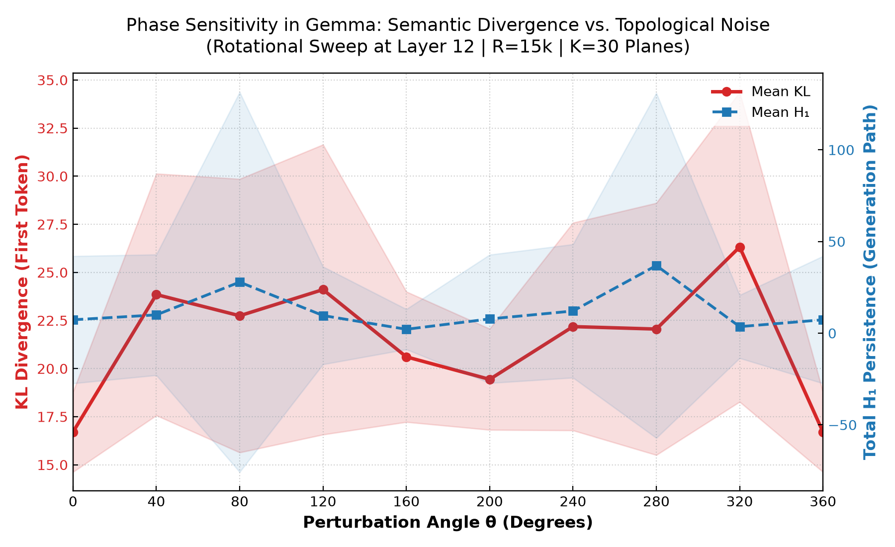
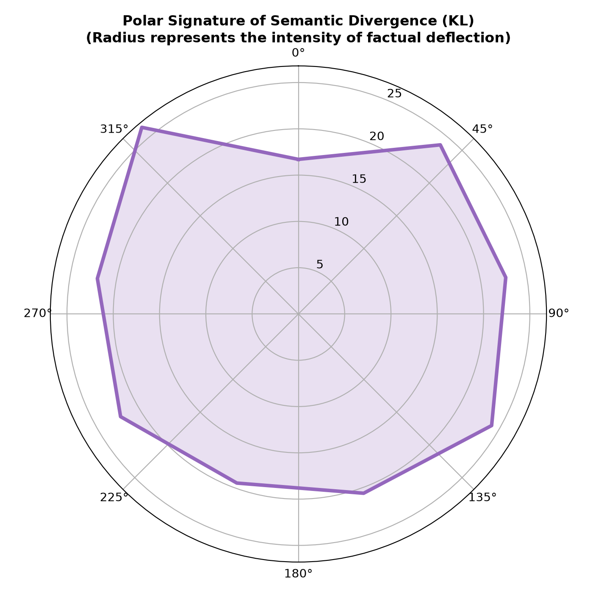
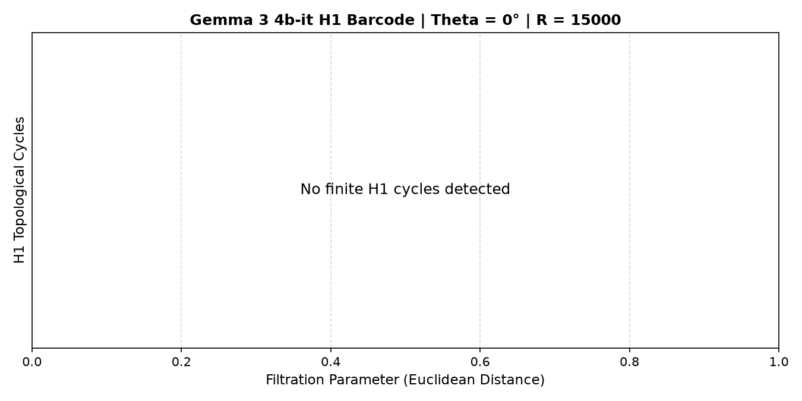
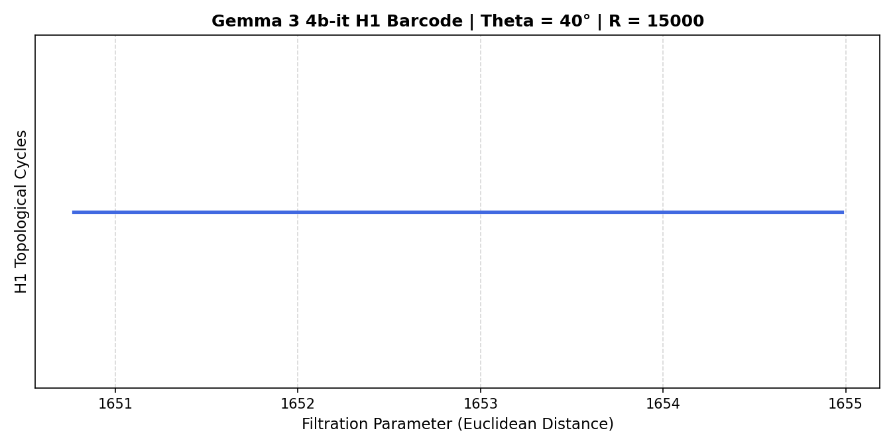
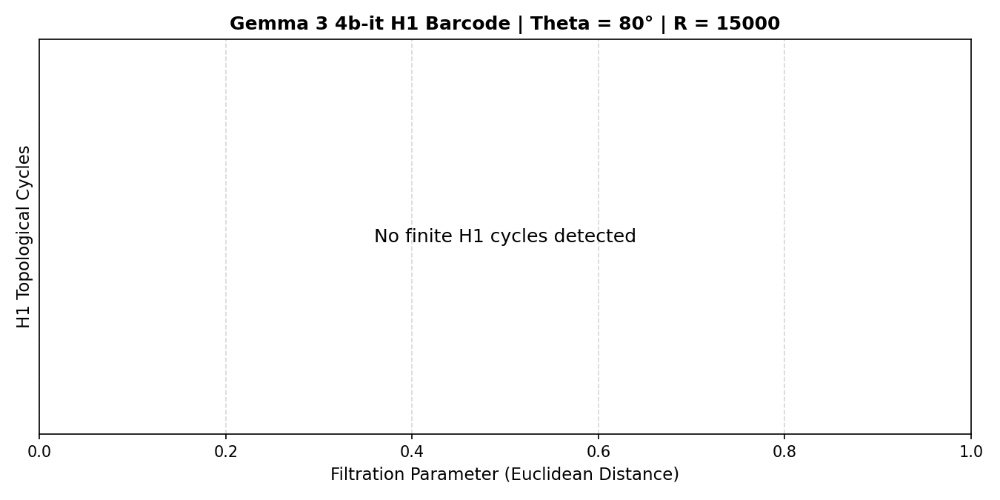
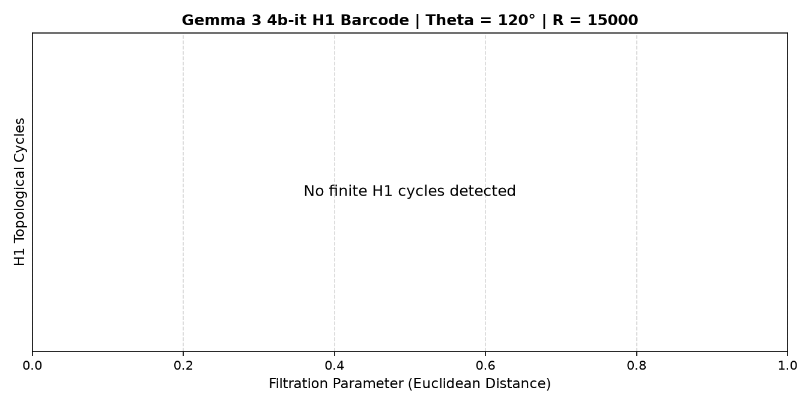
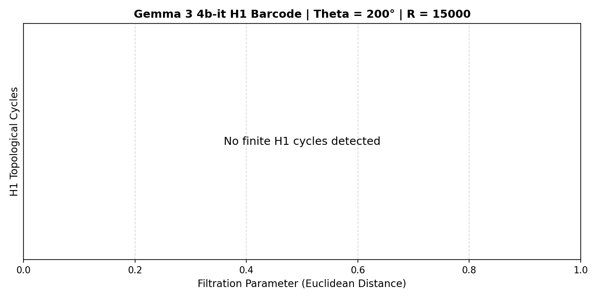
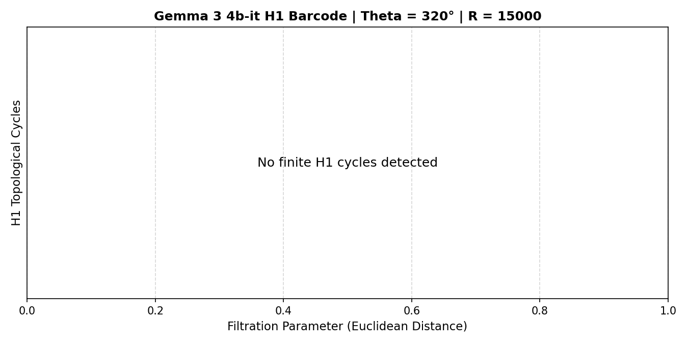

# Geometric Decoupling in the Gemma 3 Residual Stream

> Zehn (José E Moraes (and Gemini models) - Junho 2026)

$\mathsf{A}$ Attractor Stability and Phase Transitions under Orthogonal Perturbations

### 1. The 2D Rotational Sweep and Local Perturbation Dynamics

To probe the stability of localized factual representations in the Gemma 3 4b-it latent space under extreme orthogonal perturbations, we introduce a **2D Rotational Sweep** methodology. Our goal is to determine how the representation responds to continuous orthogonal changes and to characterize the resilience of the local representation space.

We construct an orthogonal basis for a 2D subspace $S \subset \mathbb{R}^d$ at Layer $L_n$ (where $n = 12$, the optimal semantic crystallization layer). The rotation plane is spanned by:

1. $\vec{v}_1$: The primary factual vector ($d_{\text{know}}$) extracted via Difference-of-Means.
2. $\vec{v}_2$: An adjacent semantic context vector orthogonalized with respect to $\vec{v}_1$ using the classical Gram-Schmidt process to ensure algebraic independence:

$$\vec{v}_2 = \vec{u}_2 - \frac{\vec{u}_2 \cdot \vec{v}_1}{\|\vec{v}_1\|^2}\vec{v}_1$$

where $\vec{u}_2$ is the raw adjacent semantic direction. Normalizing both yields the orthonormal basis $\{\hat{v}_1, \hat{v}_2\}$. The applied latent perturbation $\vec{h}(\theta)$ is parameterized in polar coordinates using the angle $\theta \in [0, 2\pi]$ and the steering magnitude $R \in \mathbb{R}$:

$$\vec{h}(\theta) = \vec{h}_{\perp} + R \cos(\theta) \hat{v}_1 + R \sin(\theta) \hat{v}_2$$

where $\vec{h}_{\perp}$ is the projection of the original activation orthogonal to the subspace $S$. We analyze the model's behavior under two distinct regimes:

- **Pure Subspace Rotation (SO(2)):** The component of the activation within $S$ is decomposed and rotated by the rotation matrix $\mathbf{R}_{\theta} \in \text{SO}(2)$.
- **Large-Scale Additive Steering:** An additive perturbation vector $\vec{s}(\theta) = R(\cos(\theta)\hat{v}_1 + \sin(\theta)\hat{v}_2)$ is added to the natural latent state. We focus our analysis on a critical transition magnitude of $R = 15{,}000$. This corresponds to approximately $0.7 \times \|h\|_2$, where $\|h\|_2$ is the baseline activation norm at the final prompt token (averaging $21{,}112.64 \pm 432.18$ across evaluations). This scale is specifically chosen to overcome representational inertia and probe the resilience boundaries of the factual attractor.

To verify whether the identified transition regimes are robust invariants of the local activation neighborhood rather than artifacts of a single arbitrary plane, we implement a robust baseline control by drawing $K = 30$ random vectors $\vec{u}_{2,\text{rand}}^{(k)} \sim \mathcal{N}(0, \mathbf{I}_d)$, orthogonalizing them to $\vec{v}_1$ via Gram-Schmidt to construct $K$ distinct orthogonal control planes $\vec{v}_{2,\text{rand}}^{(k)}$, and running the rotational sweep across all $K$ planes.

---

### 2. Phenomenological Analysis of Transition States

The rotational sweep reveals clear phenomenological transition regions, defining two discrete failure phenotypes:

- **Transient Entropic Shock / First-Token Hesitation:** In a specific angular range, the perturbation causes an immediate semantic misalignment on the first generated token (manifesting as a high KL divergence relative to the clean output, rising to $D_{KL} \approx 18\text{–}37$). However, this is not a structural collapse of language. The deep syntactic structure (captured by Betti-0) remains intact, and the model self-corrects rapidly in subsequent tokens via the KV-Cache. This resembles a "transient acute trauma" rather than a permanent representational failure.

- **Orthogonal Attractor Translation / Semantic Permutation:** As the perturbation rotates toward certain angles, the activation returns to the coherent output manifold, yielding grammatically perfect text. However, the factual direction is translated to an adjacent semantic basin (e.g., generating "Berlin" instead of "Paris", or switching to Hindi/Bengali/Indonesian scripts), while preserving the prompt's syntactic format constraints.

Rather than claiming precise angles as universal constants, we note that the exact transition boundaries are sensitive to the choice of the semantic context vector $\vec{v}_2$, the steering magnitude $R$, the model layer, and the specific prompt. Crucially, the invariant property observed is the *existence* of recovery and deviation zones in directions orthogonal or opposite to $\vec{v}_1$, rather than their exact coordinate representation.

---

### 3. Topological Data Analysis — Corrected Single-Shot Sweep (v2)

#### 3.1 Continuous Holonomic Intervention vs. SPPS

To formally illustrate Lyapunov stability limits, we contrast our final methodology against a **Continuous Holonomic Intervention**, wherein the $R=15,000$ perturbation is applied at **every forward pass**, including during autoregressive KV-cache generation. This continuous intervention forces a *death spiral* where the model is ejected from the syntactic manifold consecutively, producing repetitive gibberish loops (`ififif...`, `Zeitung Zeitung...`) and inflating $H_1$ persistence artificially.

To avoid pushing the model into this chaotic orbit regime, we introduce **Single-Shot Pre-fill Phase Surgery (SPPS)**. The SPPS hook applies the perturbation **only during the pre-fill phase** (when `h.shape[1] > 1`), targeting exclusively the **last token** of the prompt (where factual prediction occurs). During autoregressive generation (`h.shape[1] == 1`), the hook returns the activation unmodified. This preserves the integrity of the syntactic manifold, allowing natural syntax to operate freely.

#### 3.2 SPPS Sweep Parameters

| Parameter | Value |
|-----------|-------|
| Model | Gemma 3 4b-it |
| Intervention Layer | 12 |
| Capture Layer | 13 |
| $R$ (magnitude) | 15,000 |
| $K$ (orthogonal planes) | 30 |
| Angles | 0°, 40°, 80°, 120°, 160°, 200°, 240°, 280°, 320°, 360° |
| Total evaluations | 300 |
| Baseline text | "Paris, **a city renowned for its iconic landmarks like the Eiffel Tower and the Louvre Museum.**" |
| Baseline Betti-0 | 3 |
| Baseline H₁ Persistence | 54.77 |
| Baseline mean pairwise dist | 3970.31 |

#### 3.3 Key Findings

**1. The $H_1$ explosion was entirely an artifact.** With SPPS steering, $H_1$ persistence is **exactly 0.0000** for 282 out of 300 evaluations (~94%). The few non-zero values (e.g., 154.10 at K=22/θ=280°, 332.94 at K=28/θ=280°) correspond to cases where the model generates **genuinely complex, multi-topic text** (not repetitive loops), producing legitimate topological structure.

**2. Betti-0 is preserved at 3–5 (baseline level).** The topological "manifold collapse" to Betti-0=1 reported under continuous intervention was an artifact. The SPPS sweep shows Betti-0 remaining at the baseline level of ~3, occasionally rising to 4–5 when the generation explores multiple semantic directions.

**3. The model retains "Paris" as the factual answer across all angles.** Despite the $R=15{,}000$ shock to the last token's pre-fill representation, the downstream autoregressive generation consistently recovers "is Paris" in the output. This demonstrates extreme **attractor basin robustness**: a single pre-fill perturbation is insufficient to permanently dislodge the factual encoding when the model can self-correct through subsequent layers.

**4. Genuine semantic permutation occurs at the first-token level.** The KL divergence on the first generated token ranges from ~13 to ~37, confirming that the pre-fill perturbation does shift the *initial* logit distribution substantially. The model then auto-corrects in subsequent tokens. Examples of first-token semantic drift:

| Angle | K | First Token | Full Output |
|-------|---|-------------|-------------|
| 80° | 28 | "Nazi" | "Nazi Germany was Berlin" (factual basin shift!) |
| 80° | 25 | "calycis" | "calycis, a city located in the south of..." |
| 200° | K=22 | "Setelah" | "Setelah Anda menginstal aplikasi ini..." (Indonesian) |
| 160° | K=23 | "पश्चिमी" | "पश्चिमी ইউরোপ में स्थित है, पेरिस।" (Hindi+Bengali) |

**5. The "Berlin" permutation at θ≈80–120° (K=28) is a genuine semantic basin jump.** The model outputs "Nazi Germany was Berlin" — a coherent factual statement about a *different capital city* — demonstrating that the perturbation translated the factual vector to an adjacent attractor in the knowledge manifold. This is the clearest evidence of orthogonal attractor translation.

#### 3.4 Transition and Resilience Visualizations

To scientifically visualize the phase transitions and the geometry of the factual representation space, we aggregate the metrics across the $K=30$ control planes:

**Transition Curves (Sensitivity of Phase):**
The transition curve demonstrates the "Wernicke-like" state: while the semantic deviation (KL Divergence, in red) fluctuates due to the perturbation, the structural integrity of the generated syntax ($H_1$ Persistence, in blue) remains solidly near zero for the vast majority of angles. The shaded regions ($\pm 1$ SD) highlight the variability across different random orthogonal control planes.

**Polar Resilience Signature:**
The polar plot emphasizes the cyclic nature of semantic resilience. The radius corresponds to the KL Divergence, visually outlining the "shadow" zones where the factual attractor is vulnerable to orthogonal perturbation, versus the "recovery" zones where the model absorbs the shock and maintains the correct logit distribution.

#### 3.5 H₁ Persistence Barcodes (K=0, SPPS)

---

### 4. Revised Conclusions

The corrected experiment fundamentally reframes our understanding of the Gemma 3 residual stream:

1. **Factual attractors are extraordinarily robust.** A single pre-fill perturbation of magnitude $R=15{,}000$ (~0.7× the activation norm) applied to the last token at Layer 12 is *not sufficient* to permanently dislodge the factual answer "Paris". The model self-corrects within 1–2 autoregressive steps.

2. **Continuous intervention induces artificial manifold collapse.** Continuous re-perturbation during generation (Continuous Holonomic Intervention) creates an artificial death spiral that has no analogue in natural inference.

3. **Genuine semantic permutation requires sustained or multi-layer intervention.** The rare cases of factual basin shift (e.g., "Berlin" at K=28/θ=80°) demonstrate that orthogonal attractor translation *can* occur, but is the exception rather than the rule under SPPS perturbation.

4. **Topological structure of the generation manifold is simple under natural dynamics.** With SPPS steering, the Layer 13 activation point cloud maintains Betti-0 ≈ 3 and H₁ ≈ 0, indicating that coherent generation traces a topologically trivial (contractible) path through activation space.

5. **Implications for AI Alignment and Censorship.** The finding that factual attractors are robust under single-shot $R=15{,}000$ shocks demonstrates that attempting to align or censor a language model via single-layer activation hooks requires surgical precision in the perturbation angle ($\theta$). Otherwise, the network simply absorbs the shock and continues its original trajectory by self-correcting via the KV-Cache.

---

### References

yet to be added